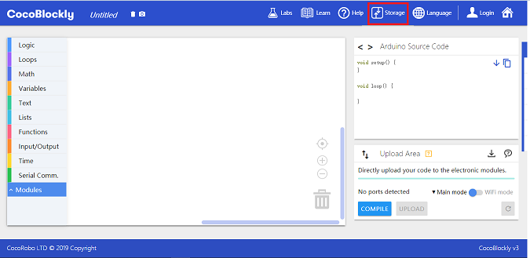
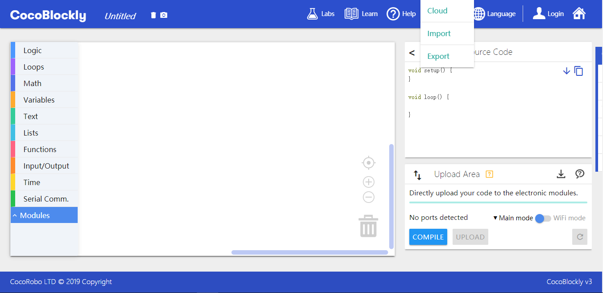
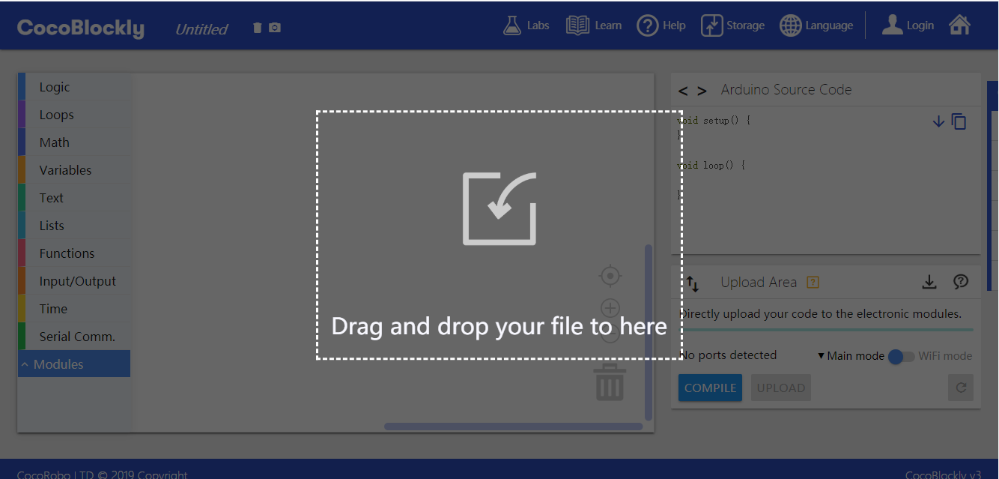
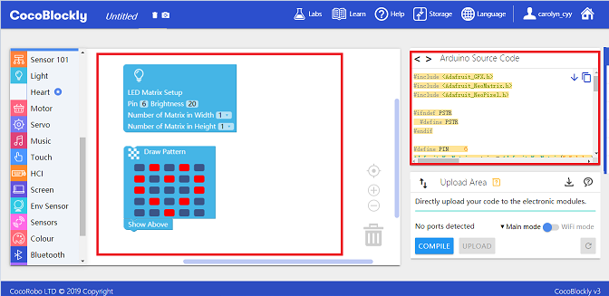
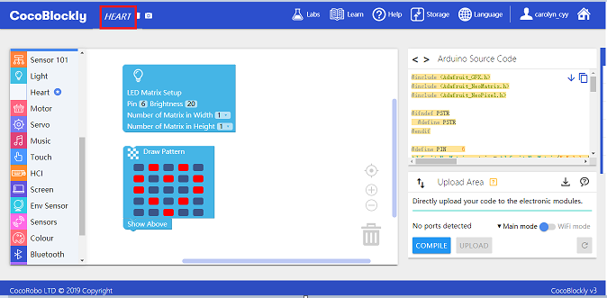
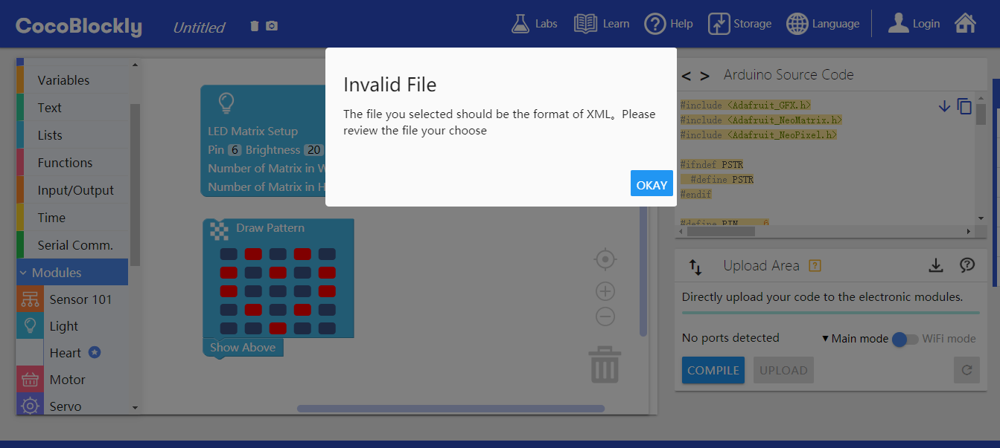
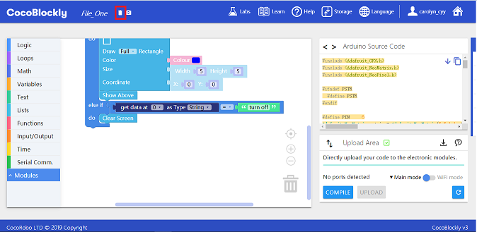
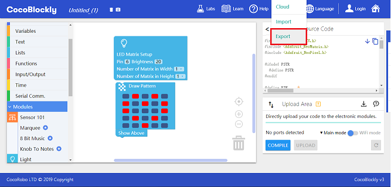
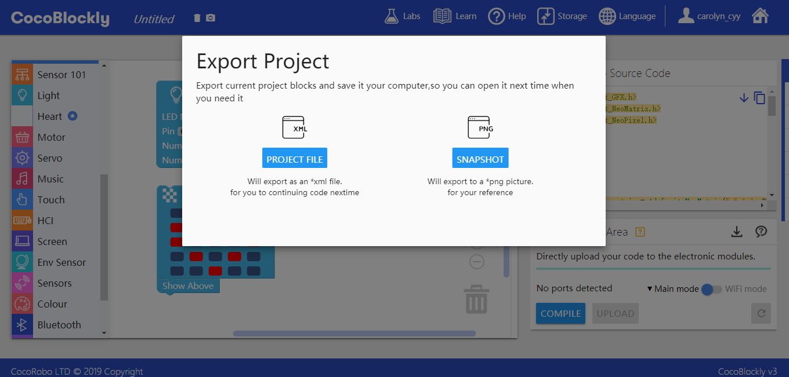

# Local Storage
---
## Introduction
CocoBlockly has a function of local storage. The blocks in the working area can be stored locally in a computer in the form of XML file or png-format picture. The XML files of blocks in the computer can be imported into working area and reinstated as blocks.

Click the "save" button, then three options can be shown: local import, local export and Cloud storage.

---

## Import Files

#### Instructions

- Option 1: Click "local import", then the Browser will pop up file selector.

Select the block files we need. __(Note: The imported files must be in the XML format and be related to CocoBlockly blocks)__

- Option 2: Directly drag blocks into the CocoBlockly interface.

After the block file is successfully imported, corresponding blocks will be generated automatically in the working area; Arduino source code will also be generated automatically in the code area.

At the same time, the name of the successfully imported file will be updated in the position of **program file name**.

#### Common Mistakes of Importing Files

<b style="background-color:#d40000; color:white; padding: 4px 5px; margin-right: 5px; border-radius:2px;">Mistake 1</b> Import files of incorrect formats such as *txt* and *docs*. Or import *XML files that are not related to CocoBlockly blocks*.

<b style="background-color:#d40000; color:white; padding: 4px 5px; margin-right: 5px; border-radius:2px;">Mistake 2</b> The imported blocks are incomplete or do not exist. This mistake is common after CocoBlockly block update. In case the blocks in the file are not compatible with CocoBlockly blocks, some blocks can also be generated in the working area. But these invalid blocks need to be written.

#### Solution to Importing Mistakes
 - Option 1: click the *bin (Delete all blocks)* icon in the navigation bar to delete all blocks.

 - Option 2: Refresh the page.

---

## Exporting Files
#### Instructions
Change file name in the **program file name** and then click the **local export** button.

Then a window with export options will pop up, where you can choose "export program file (XML format)" or "export program block snapshot (PNG format)".

---
Updated in August 2019
