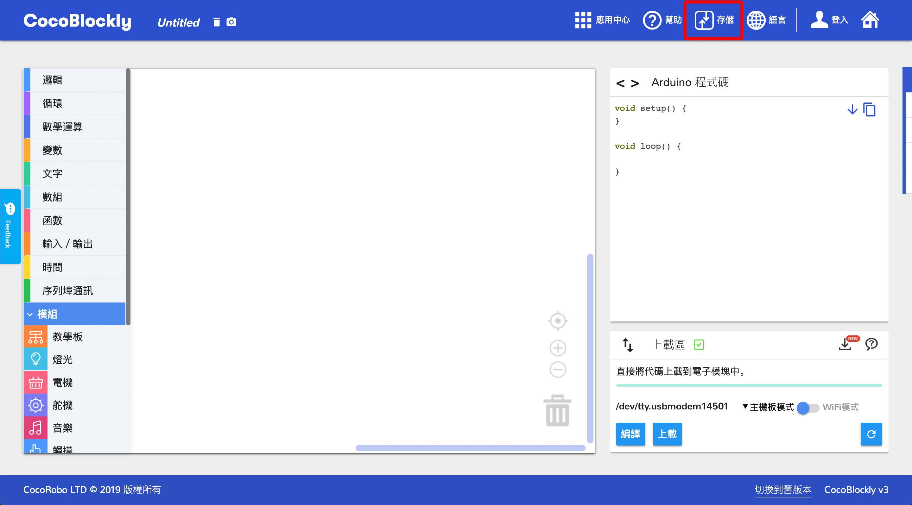
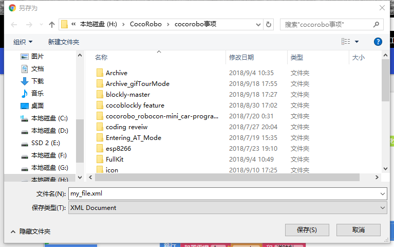

# 本地存取檔案
---
## 簡介
通過CocoBlockly的本地存儲功能，可以將工作區的積木以XML文件格式保存到本地電腦上，或者是將本地電腦的XML格式的積木文件導入並還原積木樣式至工作區。

點擊本地存儲按鈕,彈出本地導入和本地導出選項：

---

## 導入檔案
### 導入檔案操作
點擊 “本地導入”選項，瀏覽器自動彈出文件選擇器：

選擇點擊我們想要的積木文件。__（注意:導入文件格式必須為XML格式，以及内容是CocoBlockly積木相關的，才能正確導入）__
成功導入積木文件，CocoBlockly的工作區會自動生成對應積木，代碼產生區會自動產生對應代碼

同時，成功導入的檔案名會自動更新到導航欄上的**程式檔案名稱**位置

### 常見導入錯誤：
 1. 導入錯誤類型文件：如*txt*，*docs*，以及*非CocoBlockly積木相關的xml文件*等

 2. 導入積木文件不完整，或者包含不存在積木，常見于CocoBlockly版本更新后，文件版本與CocoBlockly版本不匹配。工作區生成部分積木，但無法正常使用

### 導入錯誤解決方案
 1. 點擊導航欄的*垃圾桶*圖標刪除工作區所有積木

 2. 刷新頁面即可

---

##導出檔案
###導出檔案操作
先於**程式檔案名稱**更改檔案名稱，點擊選擇**本地導出**按鈕

瀏覽器自動彈出文件選擇器，選擇檔案要保存的本地位置

