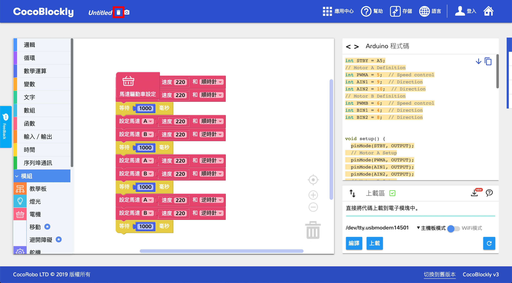

# 本地存取檔案
---
## 簡介
通過 CocoBlockly 的本地存儲功能，可以將工作區的積木以 XML 文件或 png 圖片格式保存到本地電腦上，或者是將本地電腦的 XML 格式的積木文件導入並還原積木樣式至工作區。

點擊「存儲」按鈕,彈出本地導入、本地導出和雲端存儲選項：

---

## 導入檔案

#### 導入檔案操作

- 方法一：點擊 “本地導入”選項，瀏覽器自動彈出文件選擇器：

選擇點擊我們想要的積木文件。__（注意:導入文件格式必須爲 XML 格式，以及內容是 CocoBlockly 積木相關的，才能正確導入）__

- 方法二：直接將積木文件拖入 CocoBlockly 界面中即可

成功導入積木文件，CocoBlockly 的工作區會自動生成對應積木，代碼產生區會自動產生對應代碼

同時，成功導入的檔案名會自動更新到導航欄上的**程式檔案名稱**位置

#### 常見導入錯誤：

<b style="background-color:#d40000; color:white; padding: 4px 5px; margin-right: 5px; border-radius:2px;">錯誤 1</b> 導入錯誤類型文件：如*txt*，*docs*，以及*非CocoBlockly積木相關的xml文件*等

<b style="background-color:#d40000; color:white; padding: 4px 5px; margin-right: 5px; border-radius:2px;">錯誤 2</b> 導入積木文件不完整，或者包含不存在積木，常見於CocoBlockly中積木更新後，項目文件中的積木與當前 CocoBlockly 的積木不匹配，工作區可以生成部分積木，但無效積木將會需要重新編寫

#### 導入錯誤解決方案
 - 方法一：點擊導航欄的*垃圾桶*圖標刪除工作區所有積木

 - 方法二：刷新頁面即可

---

## 導出檔案
#### 導出檔案操作
先於**程式檔案名稱**更改檔案名稱，點擊選擇**本地導出**按鈕

隨後將會彈出導出選項窗口，此處可以選擇「導出項目文件 (XML 格式)」或者「導出項目積木截圖 (PNG 格式)」：

---
更新時間：2019年8月
