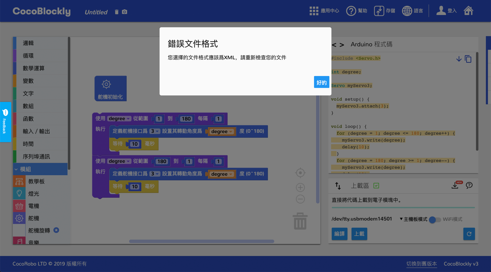

# 本地存取档案
---
## 简介
通过 CocoBlockly 的本地存储功能，可以将工作区的积木以 XML 文件或 png 图片格式保存到本地电脑上，或者是将本地电脑的 XML 格式的积木文件导入并还原积木样式至工作区。

点击「存储」按钮,弹出本地导入、本地导出和云端存储选项：

---

## 导入档案

#### 导入档案操作

- 方法一：点击 “本地导入”选项，浏览器自动弹出文件选择器：

选择点击我们想要的积木文件。__（注意:导入文件格式必须为 XML 格式，以及内容是 CocoBlockly 积木相关的，才能正确导入）__

- 方法二：直接将积木文件拖入 CocoBlockly 界面中即可

成功导入积木文件，CocoBlockly 的工作区会自动生成对应积木，代码产生区会自动产生对应代码

同时，成功导入的档案名会自动更新到导航栏上的**程序档案名称**位置

#### 常见导入错误：

<b style="background-color:#d40000; color:white; padding: 4px 5px; margin-right: 5px; border-radius:2px;">错误 1</b> 导入错误类型文件：如*txt*，*docs*，以及*非CocoBlockly积木相关的xml文件*等

<b style="background-color:#d40000; color:white; padding: 4px 5px; margin-right: 5px; border-radius:2px;">错误 2</b> 导入积木文件不完整，或者包含不存在积木，常见于CocoBlockly中积木更新后，项目文件中的积木与当前 CocoBlockly 的积木不匹配，工作区可以生成部分积木，但无效积木将会需要重新编写

#### 导入错误解决方案
 - 方法一：点击导航栏的*垃圾桶*图标删除工作区所有积木

 - 方法二：刷新页面即可

---

## 导出档案
#### 导出档案操作
先于**程序档案名称**更改档案名称，点击选择**本地导出**按钮

随后将会弹出导出选项窗口，此处可以选择「导出项目文件 (XML 格式)」或者「导出项目积木截图 (PNG 格式)」：

---
更新时间：2019年8月
