# Serial Monitor Window
---
## Introduction

Serial monitor window, which provides good assistance in debugging data (sensor and network request), is used to show the data on the development board. It can also support the export of the displayed data in the format of TXT and CSV.

## Interface

### Switch to Serial Monitor Window
You can switch to serial monitor window by clicking the second icon shown in the right toolbar.

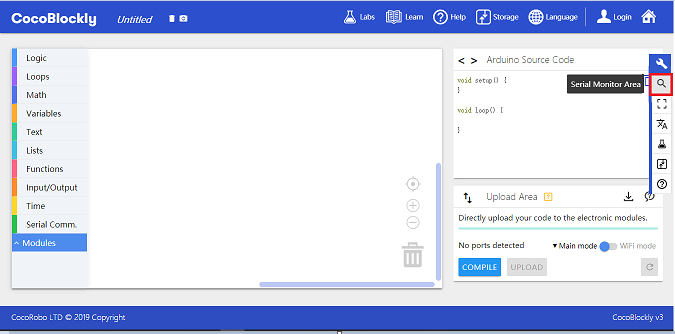

Click the icon and then the **Arduino Source Code Area** and the **program uploading area** will be switched into **serial monitor window**

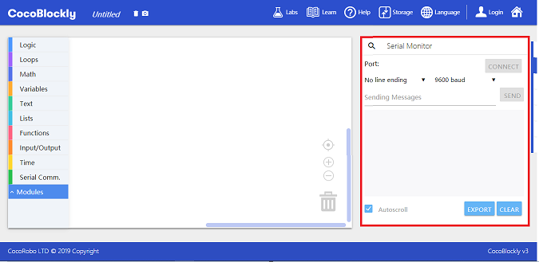

---

	Common Mistake: The program cannot be uploaded successfully after using serial monitor window.

The reason is that the serial port is connected to development board port. So the port of the main controller is occupied thus causing uploading failure.

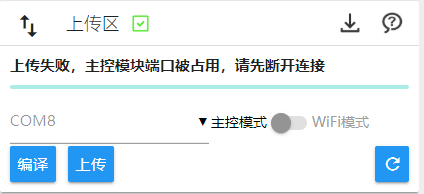

#### Solution

Switch to serial monitor window, disconnect the serial port and then you can upload programs.

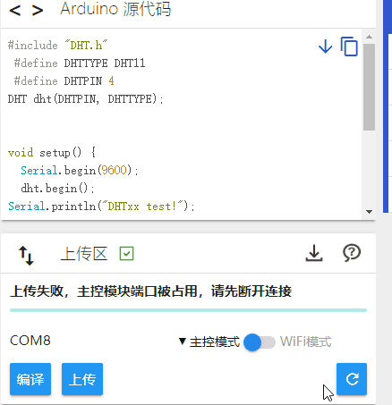

---

### Function Partitions

#### Serial port tool connection partition: connect to development board port, print data, connect to Baud rate and send data.

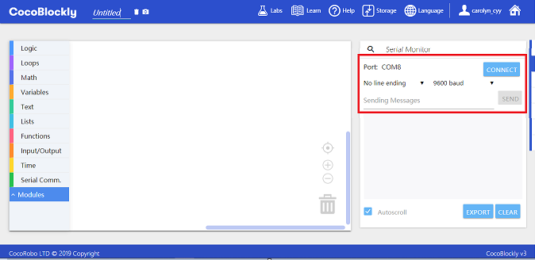

##### Print Data

1. No Line End: Print in the same line if there is no end mark.
2. NL (New Line): Begin in a new line to print the end.
3. CR (Carriage Return): Print ends with return key.
4. NL & CR: Print ends with return key and begins in a new line.

##### Baud Rate
   Baud rate refers to the amount of data a piece of equipment sends (or receives) in a second. The Baud rate of the serial port should be consistent with that of the development board so that the serial port can receive the data sent by the board. The common Baud rate is 9600 bits/s.

Serial port data print area

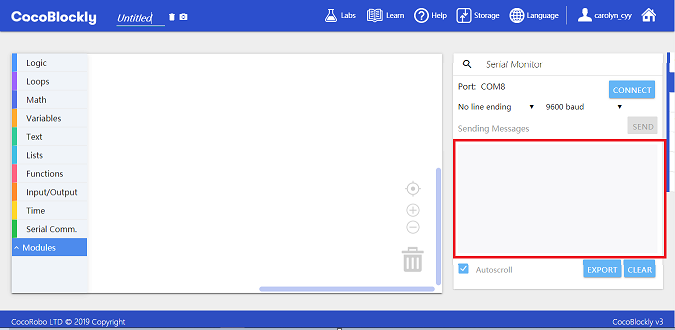

Serial port tool function partition: automatically change line for data, export data and clear the data in the demonstration area.

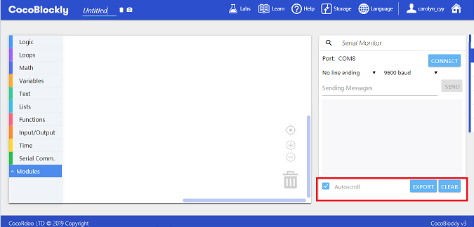

## Instruction

### Blocks

Serial monitor window needs to be used in combination with serial port communication blocks. As is shown in the following picture, the first block is the setup block which can set the Baud rate. The second block is the print block. To avoid printing the data too fast, serial port communication blocks usually need to be used in combination with time blocks.

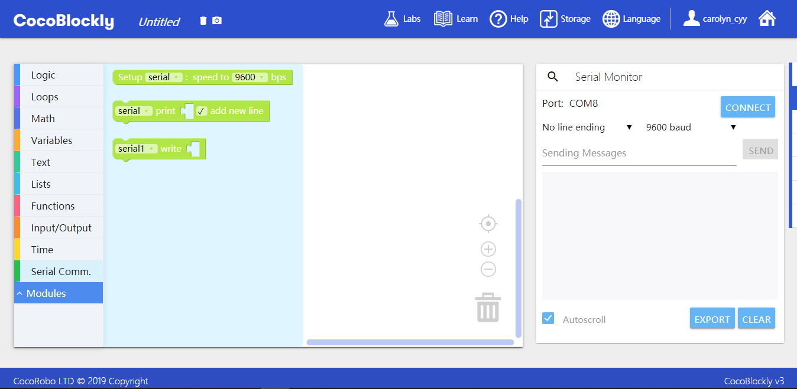

Upload the blocks in the working area to the main controller, switch to serial monitor window and click the connection button.

> Note: To avoid printing the data too fast, please add at least 50 milliseconds of delay to the print block when using serial monitor window.

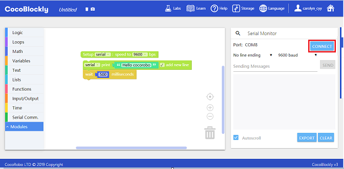

After successful connection, the connection button will be replaced by disconnection button. Data will be printed constantly in the serial port data print area.

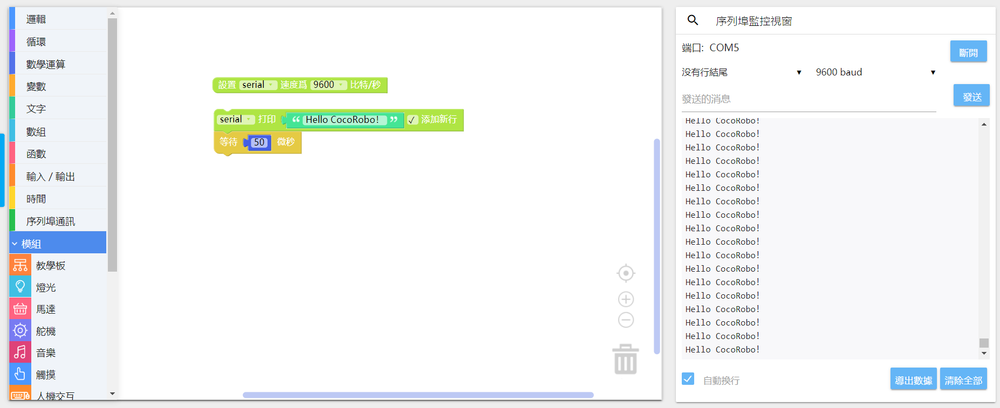

An interface for choosing the type of data will pop up after clicking data export button. This enables the data in the serial monitor window to be exported in corresponding format.

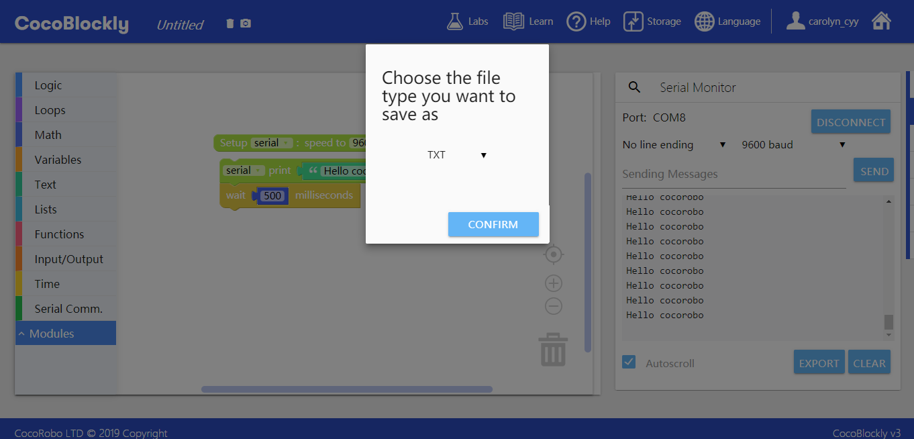

Choose a name and a location for the file to be stored.

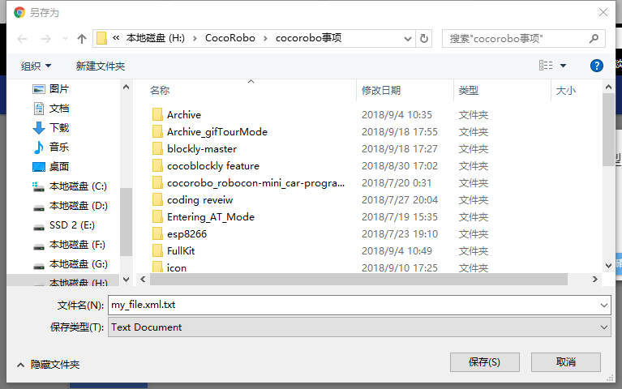

---
Updated in August 2019
