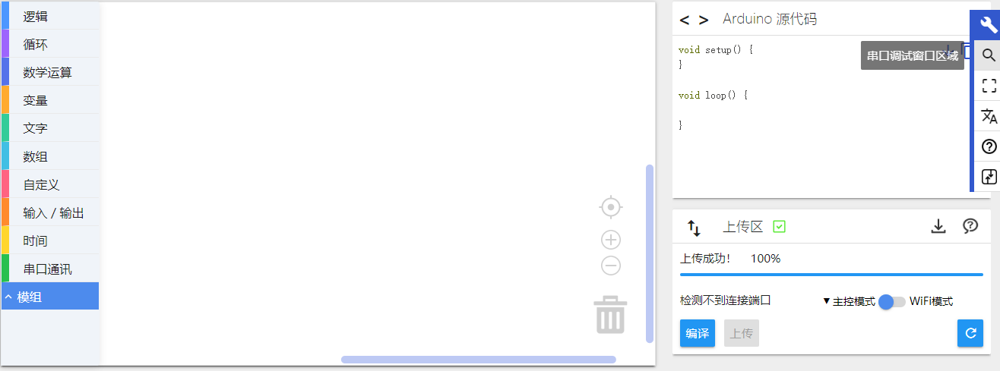
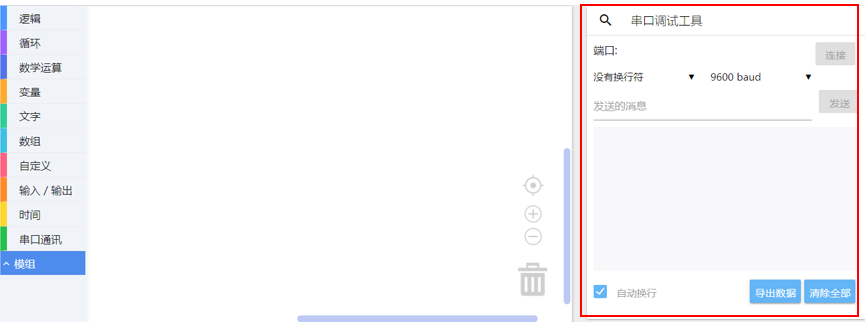
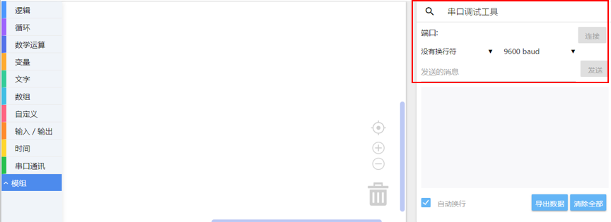
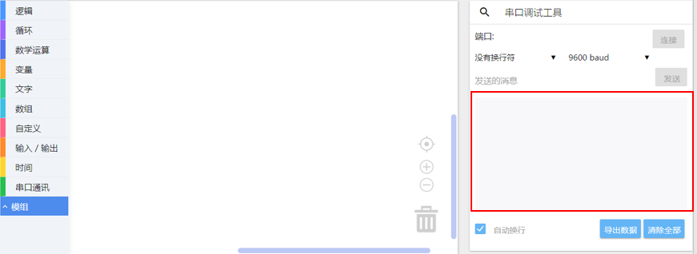
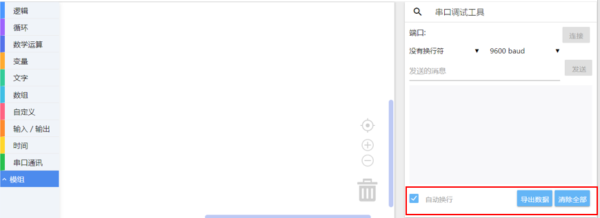
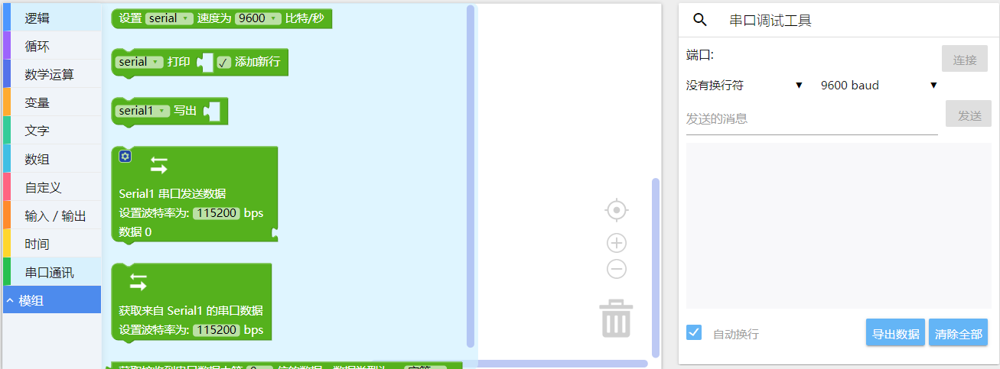
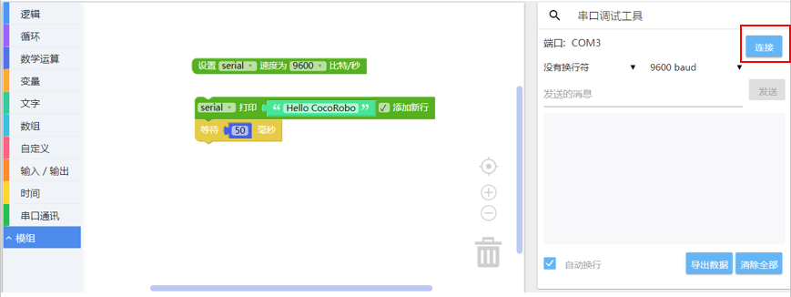
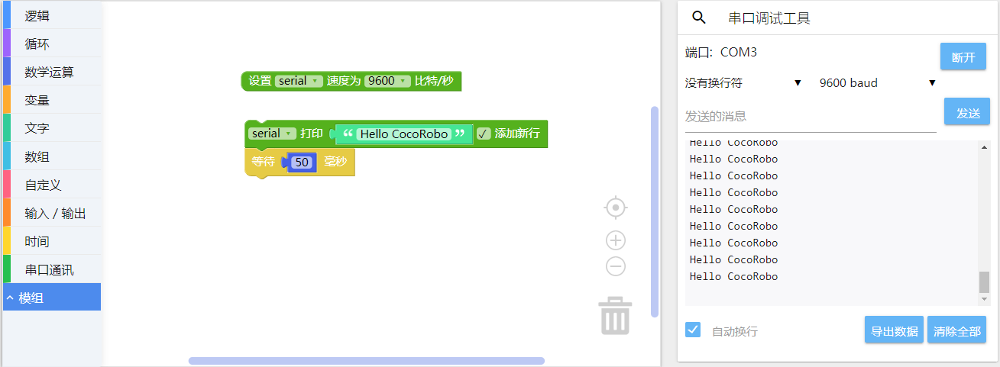
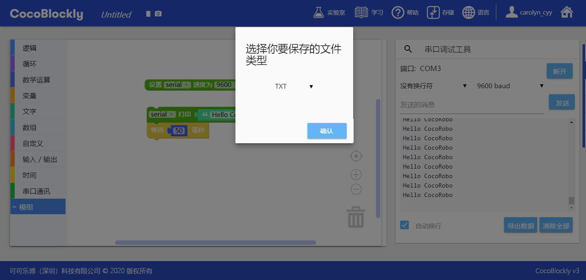

# 串口监视器
---
## 简介

串口监视器用于显示查看开发板上的数据，是调试数据（传感器、网络请求）的好帮手，该功能亦支持将显示的数据以 TXT 和 CSV 格式导出。

## 界面介绍

### 串口监视器切换
右侧工具栏悬浮显示，点击第二个按钮即可切换为串口监视器

点击切换，会将**程序代码生成区**和**程序上传区**切换成**串口监视器**

---

	常见问题请注意：使用完串口窗口后上传程序失败

这是因为串口工具正在连接著开发板端口，导致「主控模块」端口被占用，所以无法上传成功。

#### 解决方法:

切换到串口监控视窗，断开串口连接，再重新上传程序即可。

---

### 功能分区

#### 串口工具连接区：连接开发板端口，数据打印方式，连接波特率，数据发送

##### 数据打印方式

1. 没有行结尾 : 没有结束符，打印在同一行
2. NL(New Line) : 打印结尾新起一行
3. CR(Carriage Return) : 打印以回车方式结束
4. NL & CR : 打印以回车方式结束，并另起一行

##### 波特率
   波特率，通俗理解为一个设备在一秒钟内发送（或接收）的数据量。串口的波特率设置需要与开发板设置的波特率一致，这样才能正确地接收到开发板传送过来的数据。常用的波特率数值为：9600 比特/秒

串口数据打印区

串口工具功能区：数据显示自动换行，导出数据，显示区域数据清除

## 使用介绍

### 使用积木

串口监视器的使用需要配合串口通信积木。在下图中，第一个积木为初始化积木，可以设置波特率，第二个积木为打印数据积木。并且，为了避免数据打印过快，串口通信积木通常需要和时间积木一同使用

上传工作区所示积木样例至主控，切换至串口监视器（串口监控视窗），点击连接按钮

> 此处请注意：使用串口监视器时，请记得在打印积木后加入不少于 50 毫秒的延时，避免数据显示过快

成功连接后，连接按钮会被替换为断开按钮，串口数据打印区会开始不断打印数据

点击导出数据按钮，会弹出一个数据导出样式选择的简易界面，会将当前串口数据打印区数据导出成对应数据格式

选择保存文件命名和位置

---
更新时间：2019年8月
