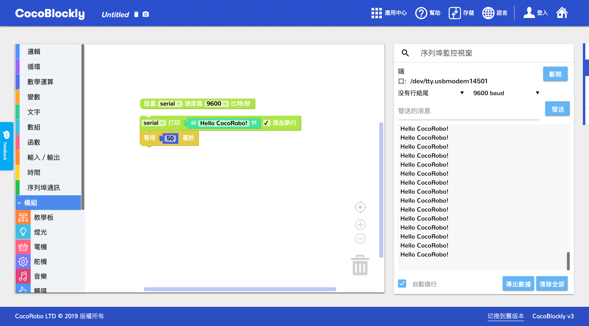

# 串口監視器
---
## 簡介
串口監視器用於顯示查看開發板上的數據，并且能將顯示的數據以txt/csv格式導出

## 界面介紹

### 串口監視器切換
右側工具欄懸浮顯示，點擊第二個按鈕即可切換為串口監視器

點擊切換，會將**程式代碼生成區**和**程式上傳區**切換成**串口監視器**

### 功能分區
#### 串口工具連接區:連接開發板端口，數據打印方式，連接波特率，數據發送

##### 數據打印方式
1. 沒有行結尾 : 沒有結束符，打印在同壹行 
2. NL(New Line) : 打印結尾新起壹行
3. CR(Carriage Return) : 打印以回車方式結束
4. NL & CR : 打印以回車方式結束，並另起壹行
##### 波特率
   波特率，通俗理解為壹個設備在壹秒鐘內發送（或接收）的數據量。
   串口的波特率設置需要與開發板設置波特率壹致，才能正確地接收到開發板傳送過來的數據，常用波特率數值為：在線轉換

串口數據打印區

串口工具功能區:數據顯示自動換行，導出數據，顯示區域數據清除

## 使用介紹
### 使用積木
串口監視器的使用需要配合序列埠通訊積木，其中第一個積木為初始化積木，可以設置波特率。第二個積木為打印數據積木。通常需要和時間積木聯用

上傳工作區所示積木樣例至主控板，切換至串口監視器（序列埠監控視窗），點擊連接按鈕

成功連接后，連接按鈕會被替換爲斷開按鈕，串口數據打印區會開始不斷打印數據

點擊導出數據按鈕，會彈出一個數據導出樣式選擇的簡易界面，會將當前串口數據打印區數據導出成對應數據格式

選擇保存文件命名和位置

