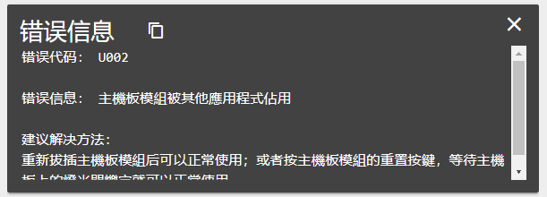
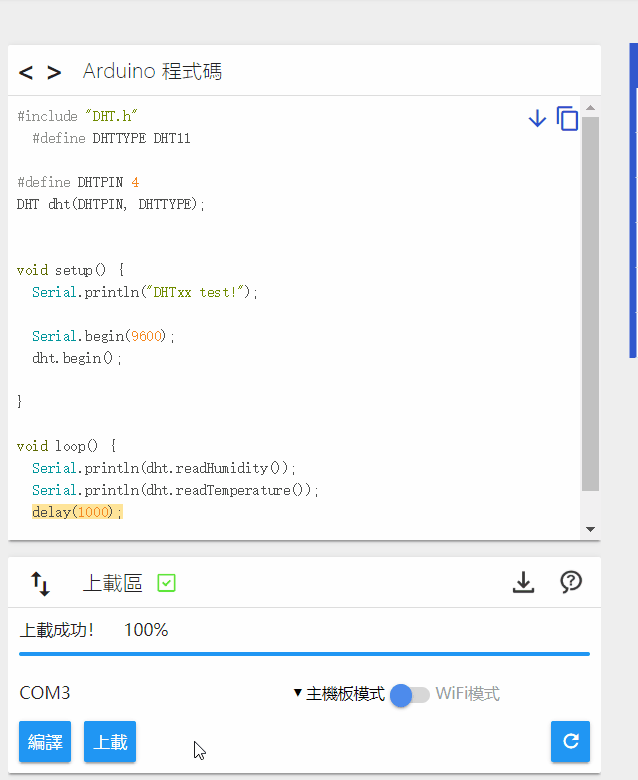
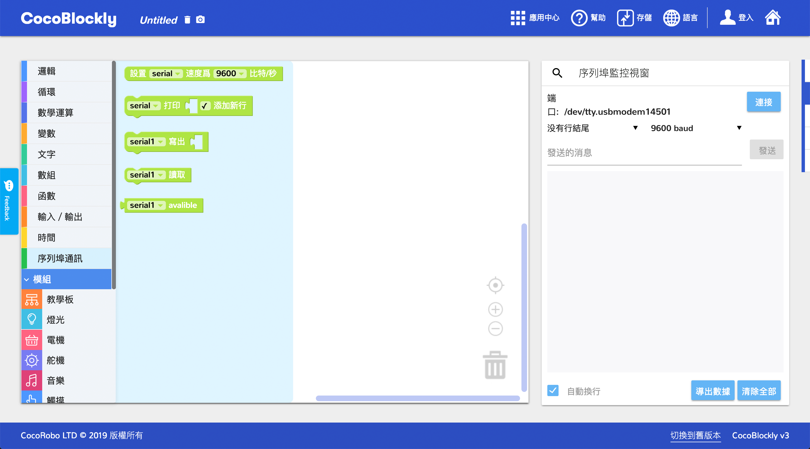
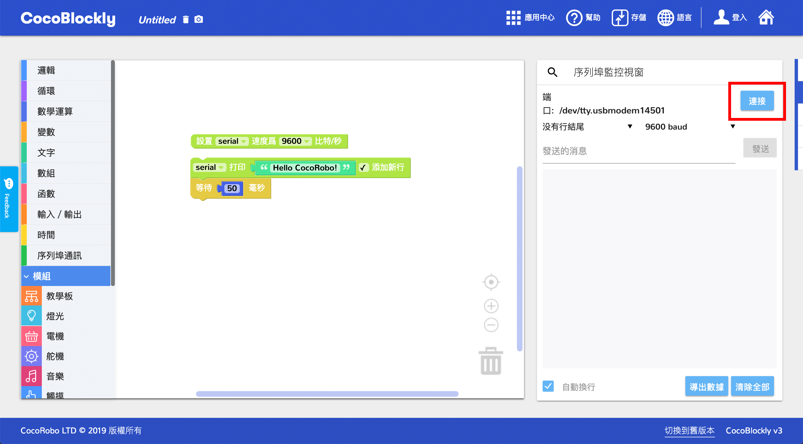
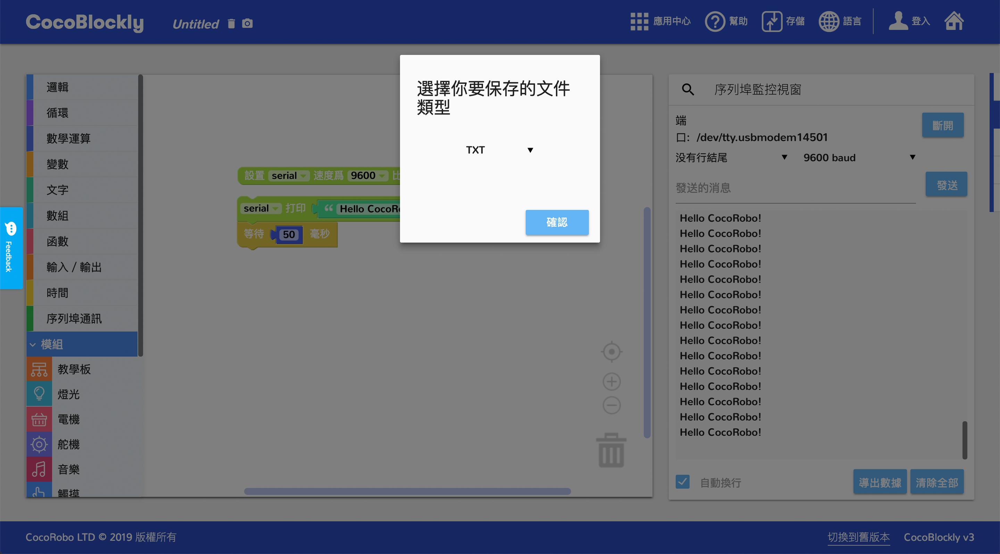

# 序列埠監視器
---
## 簡介

序列埠監視器用於顯示查看開發板上的數據，是調試數據（感應器、網絡請求）的好幫手，該功能亦支持將顯示的數據以 TXT 和 CSV 格式導出。

## 界面介紹

### 序列埠監視器切換
右側工具欄懸浮顯示，點擊第二個按鈕即可切換爲序列埠監視器

點擊切換，會將**程式代碼生成區**和**程式上傳區**切換成**序列埠監視器**

---

	常見問題請注意：使用完序列埠窗口後上傳程式失敗

這是因爲序列埠工具正在連接著開發板端口，導致「主機板模組」端口被佔用，所以無法上傳成功。

#### 解決方法:

切換到序列埠監控視窗，斷開序列埠連接，再重新上傳程式即可。

---

### 功能分區

#### 序列埠工具連接區：連接開發板端口，數據打印方式，連接波特率，數據發送

##### 數據打印方式

1. 沒有行結尾 : 沒有結束符，打印在同一行
2. NL(New Line) : 打印結尾新起一行
3. CR(Carriage Return) : 打印以回車方式結束
4. NL & CR : 打印以回車方式結束，並另起一行

##### 波特率
   波特率，通俗理解爲一個設備在一秒鐘內發送（或接收）的數據量。序列埠的波特率設置需要與開發板設置的波特率一致，這樣才能正確地接收到開發板傳送過來的數據。常用的波特率數值爲：9600 比特/秒

序列埠數據打印區

序列埠工具功能區：數據顯示自動換行，導出數據，顯示區域數據清除

## 使用介紹

### 使用積木

序列埠監視器的使用需要配合序列埠通訊積木。在下圖中，第一個積木爲初始化積木，可以設置波特率，第二個積木爲打印數據積木。并且，爲了避免數據打印過快，序列埠通訊積木通常需要和時間積木一同使用

上傳工作區所示積木樣例至主機板，切換至序列埠監視器（序列埠監控視窗），點擊連接按鈕

> 此處請注意：使用序列埠監視器時，請記得在打印積木後加入不少於 50 毫秒的延時，避免數據顯示過快

成功連接後，連接按鈕會被替換爲斷開按鈕，序列埠數據打印區會開始不斷打印數據

點擊導出數據按鈕，會彈出一個數據導出樣式選擇的簡易界面，會將當前序列埠數據打印區數據導出成對應數據格式

選擇保存文件命名和位置

---
更新時間：2019年8月
