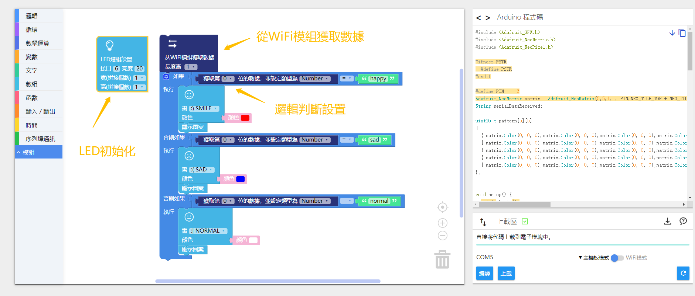
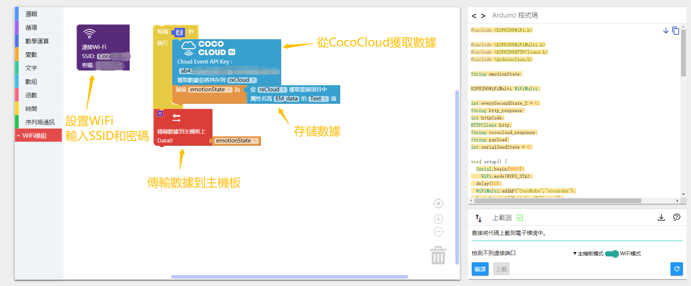

# 体验 AI 特性

## 原理

#### AI人脸识别
  通过前置摄像头抓取图片，AI系统自动识别使用者人脸照片，判断照片内容是笑脸还是苦脸，并将反馈结果存储到云端，通过WiFi模块从云端获取对应事件的数据，并传输给主控，完成后续编程项目

#### AI语音识别

通过使用麦克风抓取使用者说话音频，AI系统自动识别使用者说话内容，将内容存储到云端，通过WiFi模块从云端获取对应事件的数据，并传输给主控，完成后续编程项目

## 界面介绍

CocoBlockly界面AI使用接口

1. 人脸识别 : 点击左边的摄像头图标即可展开

a.切换按钮:点击启动电脑前置摄像头（注意：如果提示无法启动前置摄像头，需要更换连接https://cocorobo.cn/cocoblockly/）
b.点击按钮:点击电脑前置摄像头抓取图片，显示在右侧，并且反馈表情检测结果
c.事件选择：点击可选择CocoCloud内已创建事件（选择事件之前需要保证CocoBlockly账户登录）

2. 语音识别： 点击右边的麦克风图标即可展开

a.点击按钮:点击电脑前置摄像头抓取图片，显示在右侧，并且反馈表情检测结果
b.事件选择：点击可选择CocoCloud内已创建事件（选择事件之前需要保证CocoBlockly账户登录）

## 主控程序

1. 人脸识别

2. 语音识别

## WiFi程序

1. 人脸识别

< src="../media/aidemo_camera_wifi.xml">

1. 语音识别

## Cloud云端设置
点击账户登录

进入CocoCloud界面

创建事件: 点击虚框中间的加号

AI示例项目相关事件: camera/action , speech/action.

## 效果展示

人脸识别Demo: 人脸识别笑脸或苦脸，通过LED显示检测结果

sad face 效果展示：抓取图片后保存图片，并且显示反馈信息"sad face"

查看云端项目事件

主控和WiFi模块

---
更新时间：2019年8月
