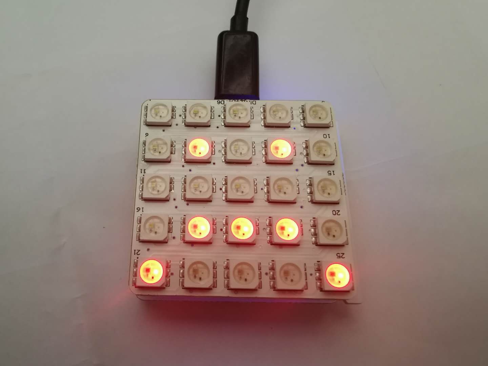

# 體驗 AI 特性

## 原理

#### AI人臉識別
  通過前置攝像頭抓取圖片，AI系統自動識別使用者人臉照片，判斷照片內容是笑臉還是苦臉，並將反饋結果存儲到雲端，通過WiFi模組從雲端獲取對應事件的數據，並傳輸給主機板，完成後續編程項目

#### AI語音識別

通過使用麥克風抓取使用者說話音頻，AI系統自動識別使用者說話內容，將內容存儲到雲端，通過WiFi模組從雲端獲取對應事件的數據，並傳輸給主機板，完成後續編程項目

## 界面介紹

CocoBlockly界面AI使用接口

1. 人臉識別 : 點擊左邊的攝像頭圖標即可展開

a.切換按鈕:點擊啓動電腦前置攝像頭（注意：如果提示無法啓動前置攝像頭，需要更換連接https://cocorobo.hk/cocoblockly/）
b.點擊按鈕:點擊電腦前置攝像頭抓取圖片，顯示在右側，並且反饋表情檢測結果
c.事件選擇：點擊可選擇CocoCloud內已創建事件（選擇事件之前需要保證CocoBlockly賬戶登陸）

2. 語音識別： 點擊右邊的麥克風圖標即可展開

a.點擊按鈕:點擊電腦前置攝像頭抓取圖片，顯示在右側，並且反饋表情檢測結果
b.事件選擇：點擊可選擇CocoCloud內已創建事件（選擇事件之前需要保證CocoBlockly賬戶登陸）

## 主機板程式

1. 人臉識別
   

2. 語音識別

## WiFi程式

1. 人臉識別
   
< src="../media/aidemo_camera_wifi.xml">

1. 語音識別
 

## Cloud雲端設置
點擊賬戶登陸

進入CocoCloud界面

創建事件: 點擊虛框中間的加號

AI示例項目相關事件: camera/action , speech/action.

## 效果展示

人臉識別Demo: 人臉識別笑臉或苦臉，通過LED顯示檢測結果

sad face 效果展示：抓取圖片後保存圖片，並且顯示反饋信息"sad face" 

查看雲端項目事件

主機板和WiFi模組

