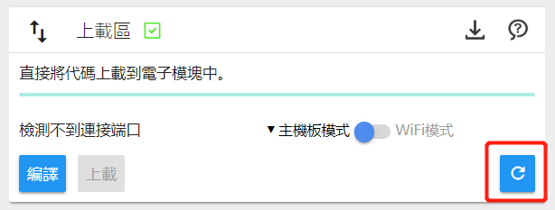

# 什么是 CocoBlockly

CocoBlockly 是一种基于 Blockly 视觉化编程积木的程序设计开发环境，支持多语言（简体中文、繁体中文和英文），用户通过拖拽具有特定功能的编程积木即可轻松撰写相关的程序，赋予电子产品以多种多样的功能。

第一次使用 CocoBlockly 的用户，请前往[该页面](/getting-started/info)链接下载 **CocoBlockly Uploader 上载软件**，支持 Windows 及 macOS。
### 使用必读

#### 准备事项：

1. 安装 CocoBlockly Uploader（请从以下连结获取最新版本）:
  1. Windows: https://api.cocorobo.hk/releases/uploaderv2/download/windows
  2. macOS: https://api.cocorobo.hk/releases/uploaderv2/download/mac
2. 开启浏览器，我们推荐使用 Google Chrome，请前往[此处](/getting-started/info?id=cocoblockly-uploader)检视完整的支援列表，如果您还没有安装合适的浏览器，可前往下方链接下载:
  1. 安装 Google Chrome：https://www.google.com/chrome/
3. 以上步骤全部准备完成后，前往 [http://cocorobo.cn/cocoblockly/dev/](http://cocorobo.cn/cocoblockly/dev/) ，检查介面右下角的「上载区」是否有绿色的打勾图示，如有，则表示安装成功，这时你可以开始进行程序编写，并上传至你的电子模块中了。

#### 注意事项：

1. 如果您使用的是 Windows 电脑，请确保您所在的计算机账户拥有管理员权限（Administrator），我们的 CocoBlockly Uploader 需要管理员权限才能够正常安装；
2. 请不要在上传过程中直接拔掉主控模块或者 WiFi 通信模块；
3. 请不要使用不支持的浏览器和操作系统（推荐使用 Google Chrome）；
4. 请不要在上传过程中按到主控模块上的重置（Reset）按钮；
5. 当主控已经连接，但页面仍然没有显示端口时，可以点击页面右下角的「重启Uploader」按钮，重启上传插件；

6. 如果出现上传失败或者编译失败的情况，请将错误信息复制记下，寄信给 support@cocorobo.cc ，以便技术支持人员了解

---

## 教程索引

- [关于 CocoBlockly](index)
- [开始使用 CocoBlockly](/getting-started/info)
	- [软件安装指引](/getting-started/installation)
	- [编程界面介绍](/getting-started/gui)
	- [本地存取档案](/getting-started/local-storage)
	- [云端存取档案](/getting-started/cloud-storage)
	- [串口监视器](/getting-started/serial-monitor)
- [电子模块基本教学](/cocomod/overview)
	- [使用主控模块](/cocomod/main-controller)
	- [使用教学模块](/cocomod/sensor-101)
	- [使用LED灯屏模块 ](/cocomod/led-matrix)
	- [使用屏幕模块](/cocomod/screen)
	- [使用音乐模块](/cocomod/music)
	- [使用触摸传感模块](/cocomod/touch)
	- [使用环境传感模块](/cocomod/environment)
	- [使用电机驱动模块](/cocomod/motor-driver)
	- [使用颜色分析模块](/cocomod/color-analyzer)
	- [使用运动传感模块](/cocomod/motion)
	- [使用蓝牙通信模块](/cocomod/bluetooth)
	- [使用伺服电机转接模块](/cocomod/servo)
	- [使用转接模块](/cocomod/hub)
	- [使用平行转接模块](/cocomod/horizontal-adapter)
	- [使用正反转接模块](/cocomod/reversed-adapter)
	- [使用第三方传感器](/cocomod/3rd-party)
	- [使用 WiFi 通信模块](/cocomod/wifi)
	- [使用 Coco Cloud](/cocomod/coco-cloud)
	- [使用 ThingSpeak](/cocomod/thingspeak)
	- [使用 IFTTT](/cocomod/ifttt)
	- [使用 NB-IoT 通信模块](/cocomod/nbiot)
	- [体验 AI](/getting-started/ai)
- [课程套件教学](/kit/overview)
  - [创意电子套件](/kit/creative-electronics)
  - [动力小车套件](/kit/robot-car)
  - [智能家居套件](/kit/smart-home)
  - [人工智能套件](/kit/aiot)
  - [机械达人套件](/kit/robot-arm)
- [项目制作教学](/projects/overview)
	- [创意电子类](/projects/creative-electronics)
	- [机械类](/projects/mechanical-device)
	- [智能家居类](/projects/smart-home)
	- [人工智能类](/projects/ai)
- [常用问题解答](faq)
- [版本更新日志](changelog)

<!---  [可穿戴类](/projects/wearable-device)[物联网类](/projects/iot)
[学科融合类](/projects/interdisciplinary)-->
