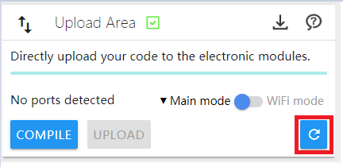

# CocoBlockly

CocoBlockly is a program design and development environment based on Blockly visualization programming blocks. It supports three languages (simplified Chinese, traditional Chinese and English). You can write programs and endow electronic products with multiple functions just by dragging blocks with specific functions.

First-time CocoBlockly user should go to [Programming Environment](/getting-started/info) to download **CocoBlockly Uploader**. Windows and macOS are supported.
### Notice

#### Preparations

1. Install CocoBlockly Uploader (Please go to following link for the latest version):
  1. Windows: https://api.cocorobo.hk/releases/uploaderv2/download/windows
  2. macOS: https://api.cocorobo.hk/releases/uploaderv2/download/mac
2. Open the browser (Google Chrome is recommended). Please go to [Here](/getting-started/info?id=cocoblockly-uploader) to check the whole support list. If you haven't installed a suitable browser, you can go to the following link to download Google Chrome:
  1. Install Google Chrome: https://www.google.com/chrome/
3. Please go to [http://cocorobo.cn/cocoblockly/dev/](http://cocorobo.cn/cocoblockly/dev/) after completing the above steps. See if the box of the "uploading area" at the lower right is checked with a green tick. If it is, you have already installed it successfully; you can begin to write programs and upload them to electronic modules.

#### Important Notes:

1. Please make sure that the account has administrator rights if you are using a computer with Windows system. CocoBlockly Uploader can be installed on the premise that administrator rights are granted.
2. Please do not disconnect the main controller or the WiFi communication module in the process of uploading.
3. Please do not use those browsers and operating systems that are not supported (Google Chrome is recommended).
4. Please do not press the Reset button of the main controller in the process of uploading.
5. If the main controller is already connected but the port is still not shown in the interface, you can reset the plugin by clicking the "Relaunch Uploader" button at the lower right corner of the interface.

6. In the event of uploading failure or compiling failure, please record the failure information and email it to support-hk@cocorobo.cc to ask for technical assistance.

---

## Tutorial Index

- [CocoBlockly](index)
- [Start to Use CocoBlockly](/getting-started/info)
	- [CocoBlockly Uploader Installation Instructions](/getting-started/installation)
	- [CocoBlockly Interface](/getting-started/gui)
	- [Local Storage](/getting-started/local-storage)
	- [Cloud Storage](/getting-started/cloud-storage)
	- [Serial Monitor](/getting-started/serial-monitor)
- [Electronic Modules](/cocomod/overview)
	- [Apply Main Controller](/cocomod/main-controller)
	- [Apply Sensor 101 Module](/cocomod/sensor-101)
	- [Apply LED Matrix Module ](/cocomod/led-matrix)
	- [Apply Screen Module](/cocomod/screen)
	- [Apply Music Module](/cocomod/music)
	- [Apply Touch Analyzing Module](/cocomod/touch)
	- [Apply Environmental Sensing Module](/cocomod/environment)
	- [Apply Motor Driver Module](/cocomod/motor-driver)
	- [Apply Color Analyzing Module](/cocomod/color-analyzer)
	- [Apply Motion Sensing Module](/cocomod/motion)
	- [Apply Bluetooth Communication Module](/cocomod/bluetooth)
	- [Apply Servo Hub Module](/cocomod/servo)
	- [Apply Hub Module](/cocomod/hub)
	- [Apply Parallel Adapting Module](/cocomod/horizontal-adapter)
	- [Apply Reverse Adapting Module](/cocomod/reversed-adapter)
	- [Apply Third Party Sensors](/cocomod/3rd-party)
	- [Apply WiFi Communication Module](/cocomod/wifi)
	- [Apply Coco Cloud](/cocomod/coco-cloud)
	- [Apply ThingSpeak](/cocomod/thingspeak)
	- [Apply IFTTT](/cocomod/ifttt)
	- [Apply NB-IoT Communication Module](/cocomod/nbiot)
	- [Experience the Features of AI](/getting-started/ai)
- [Kit Overview](/kit/overview)
	- [Creative Electronics](/kit/creative-electronics)
	- [Robot Car](/kit/robot-car)
	- [Smart Home](/kit/smart-home)
	- [AI Suite](/kit/aiot)
	- [Robot Arm](/kit/robot-arm)
- [Project Overview](/projects/overview)
	- [Creative Electronics](/projects/creative-electronics)
	- [Mechanical Device](/projects/mechanical-device)
	- [Smart Home](/projects/smart-home)
	- [AI](/projects/ai)
- [FAQ](faq)
- [Change Log](changelog)

<!---  [可穿戴類](/projects/wearable-device)[物聯網類](/projects/iot)
[學科融合類](/projects/interdisciplinary)-->
