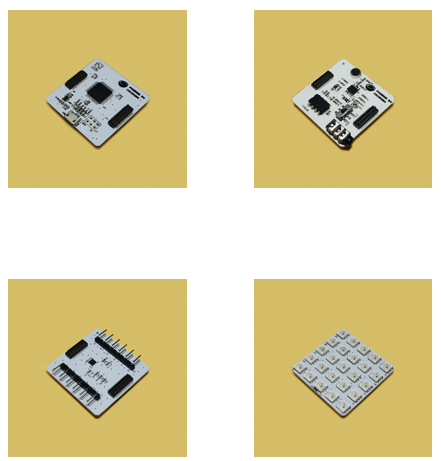
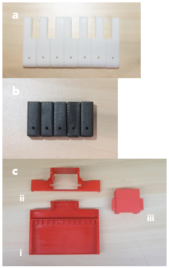
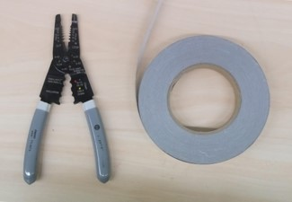
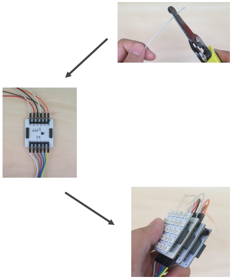
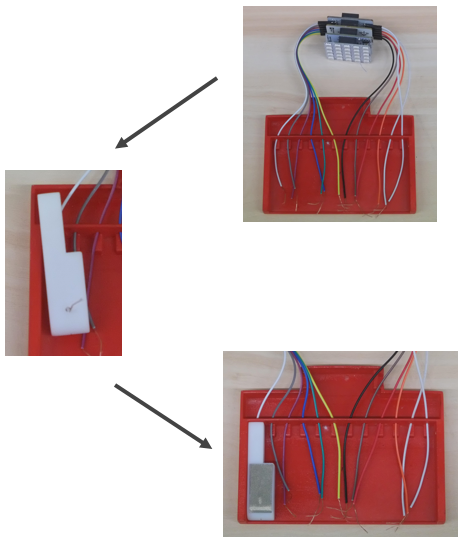
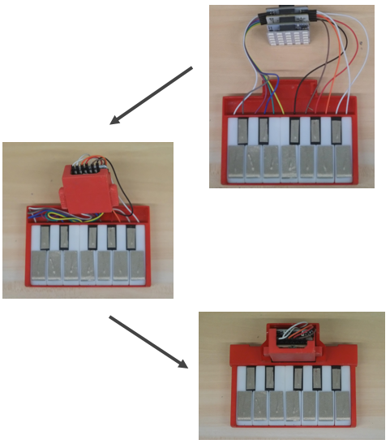
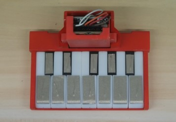
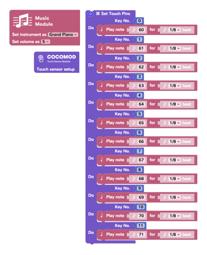

# 創意電子
---
## 模組介紹
- [主機板模組](/cocomod/main-controller)
- [LED 燈模組](/cocomod/led-matrix)
- [音樂模組](/cocomod/music)
- [觸摸感應模組](/cocomod/touch)
## 迷你燈光電子琴組裝
### 準備材料
電子模組：
- 主機板模組
- 音樂模組
- LED 燈模組
- 觸碰感應模組

3D打印材料：
- 白色琴鍵 x 7
- 黑色琴鍵 x 5
- 琴身組件：電子琴底座、模組支架、模組容器

工具：
- 剪線鉗
- 導電紙

### 組裝步驟
首先，用剪線鉗將杜邦線的一頭去掉，露出大約2-3cm的銅絲。

將處理過的杜邦線全部接到觸碰感應模組中。

將4個電子模組組合起來。由上到下，分別是LED燈光模組，主機板模組，觸碰感應模組和音樂模組。

然後，將杜邦線從電子琴底部的孔中穿過去。從左至右，杜邦線對應在觸摸感應上的引針的數位編號爲從0到11。

將杜邦線中暴露出來的銅絲穿過白色琴鍵（或黑色琴鍵）中的孔。

剪下一塊尺寸合適的導電紙，並且和銅絲一起貼在琴鍵上。

此步驟重複至所有琴鍵觸摸設置完成。

將電子模組放入模組容器中。

最後，將模組容器穿過模組支架，並且將支架固定在電子琴底座上。

迷你燈光電子琴組裝完成。

完整的迷你燈光電子琴就如下圖。

## 迷你電子琴編程
前往 CocoBlockly，使用「音樂」一欄的積木，完成右側的程式設計，上傳後即可出現電子琴的效果

###### Send your question to  [it@cocorobo.hk](http://cocorobo.hk/online/)  for support
