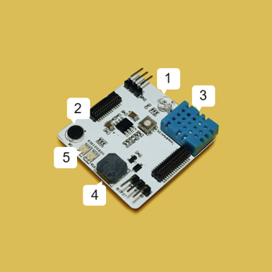

# Creative Electronics

---

## Course Introduction

Students can use the modules in the kits and their corresponding materials in combination with 3D printing and programming to make a program. The themes of the kits are different from one another, with each kit having its module, sensor, accessories and so on. Students can learn to use the electronic modules in the CocoMod better and faster through their matched courses.

## Syllabus

<table>
   <tr>
      <td><strong>No.</td>
      <td><strong>Unit</td>
      <td><strong>Contents</td>
   </tr>
   <tr>
      <td>1</td>
      <td rowspan=3>Basic Learning</td>
      <td>Introduction: creative electronic interaction arts</td>
   </tr>
   <tr>
      <td>2</td>
      <td>Learn electronic modules, programming platform and light matrix</td>
   </tr>
   <tr>
      <td>3</td>
      <td>Project: familiarize yourself with matrix and electronic badges</td>
   </tr>
   <tr>
      <td>4</td>
      <td rowspan=4>Interaction Lights</td>
      <td>Blinking lights</td>
   </tr>
   <tr>
      <td>5</td>
      <td>Color-changing lights</td>
   </tr>
   <tr>
      <td>6</td>
      <td>Touching Lights</td>
   </tr>
   <tr>
      <td>7</td>
      <td>Project: interaction light games</td>
   </tr>
   <tr>
      <td>8</td>
      <td rowspan=4>Digital Instruments</td>
      <td>touch analyzing module and music module</td>
   </tr>
   <tr>
      <td>9</td>
      <td>MIDI music</td>
   </tr>
   <tr>
      <td>10</td>
      <td>Project: design digital instrument (1)</td>
   </tr>
   <tr>
      <td>11</td>
      <td>Project: design digital instrument (2)</td>
   </tr>
   <tr>
      <td>12</td>
      <td rowspan=3>Music Picture Book</td>
      <td>MP3 music module</td>
   </tr>
   <tr>
      <td>13</td>
      <td>Project: music picture book (1)</td>
   </tr>
   <tr>
      <td>14</td>
      <td>Project: music picture book (2)</td>
   </tr>
   <tr>
      <td>15</td>
      <td rowspan=4>Design of Creative Electronic Products</td>
      <td>Design Thinking: creative electronics</td>
   </tr>
   <tr>
      <td>16</td>
      <td>Final Project: Design and make a creative electronic product (1)</td>
   </tr>
   <tr>
      <td>17</td>
      <td>Final Project: Design and make a creative electronic product (2)</td>
   </tr>
   <tr>
      <td>18</td>
      <td>Final Project: Design and make a creative electronic product (3)</td>
   </tr>
   <tr>
      <td>19</td>
      <td rowspan=2>Demonstration and Appraisal of the Products</td>
      <td>Product demonstration</td>
   </tr>
   <tr>
      <td>20</td>
      <td>Product appraisal</td>
   </tr>
   <tr>
      <td>Optional Modules</td>
      <td>Strip of Lights</td>
      <td>1) Familiarize yourself with strip of lights, learn connection methods and realize simple effect. 2)	Realize complicated effects such as revolving lantern. 3)	Proect of interaction strip of lights.</td>
   </tr>
   <tr>
      <td>Optional Modules</td>
      <td>Assembly of Multiple Matrices</td>
      <td>1)	Learn how to connect two LED matrix modules and realize simple effect. 2)	Learn how to connect over two LED matrix modules and realize relatively complicated animated effect. 3)	Animated effect of multiple matrices.</td>
   </tr>
   <tr>
      <td>Optional Modules</td>
      <td>Finger-guessing Artifact</td>
      <td>1)	Learn touch analyzing module, conditional statements, variables and random numbers thoroughly. 2)	Interaction Program: finger-guessing Artifact</td>
   </tr>
   <tr>
      <td>Optional Modules</td>
      <td>Gamepad</td>
      <td>1)	Touching and gamepad 2)	Interaction Program: gamepad and scratch game</td>
   </tr>
</table>

## Module Instruction

The following table shows the modules involved in this course kit:

|No. |Modules | Pictures |Introduction | Details |
|-  |-  |-  |- |- |
|1. | Main Controller  |  | Main Controller can be regarded as "the brain" if electronic modules were the human body. Programs written in CocoBlockly are "the ideas" aiming to tell "the brain" (main controller) what to do. Once "the ideas" are transmitted to "the brain", the main controller will control other modules to do what is commanded. | [Click here](/cocomod/main-controller) |
|2. | LED Matrix Module  |  | LED matrix module is an electronic module with multiple LED lights in it. You can create various pictures by turning on different lights and controlling the colors of the lights. | [Click here](/cocomod/led-matrix) |
|3. | Music Module  |  | Music module is used for playing the sounds of musical instruments and music files. The module can emit the sounds of more than 100 musical instruments. It has a SD card socket and supports playing music of ".ogg" format or ".mp3" format. In the current version of CocoBlockly, users can play the sounds of various musical instruments and music files through music module. | [Click here](/cocomod/music) |
|4. | Touch Analyzing Module  |  | Touch analyzing module is usually used in combination with conductive paper. The conductive paper is connected to the pins on the module via Dupont jumper wire. After connecting the conductive paper to the pins, you can send a potential signal to the module by either touching the pins or the conductive paper. The position of the potential signal is where you touch. | [Click here](/cocomod/touch) |

## Assemble Mini Electronic Organ with Lights

### Preparations

Electronic Modules:

- main controller
- music module
- LED matrix module
- touch analyzing module

3D printing materials
- white key x 7
- black key x 5
- Main Structure: the base of electronic organ, module holder and module container

Tool:
- pliers
- conductive paper

### Procedures

1. Use pliers to cut one side of the Dupont jumper wires and expose 2-3cm of copper wire.

2. Connect the Dupont jumper wire to touch analyzing module.

3. Put the four electronic modules together: LED matrix module, main controller, touch analyzing module and music module from top to bottom respectively.

4. Thread the Dupont jumper wires to the holes at the bottom of the electronic organ. The Dupont jumper wires correspond to the pins of touch analyzing module whose numbers are 0 to 11 respectively from left to right.

5. Thread the exposed copper wires of the Dupont jumper wires to the holes of the white (or black) keys.

6. Cut a piece of proper-size conductive paper and paste it on a key together with a exposed copper wires.

7. Repeat the 6th procedure until all keys are set successfully.

8. Put electronic modules into the module container.

9. Put the module container into the module holder and fix the holder on the base of the electronic organ.

10. The assembly is finished.

11. The following picture shows the complete mini electronic organ with lights

## Program the Mini Electronic Organ with Lights

Go to  [CocoBlockly](https://cocorobo.hk/cocoblockly/dev/?lang=zh-hant) and use the blocks in "Music" to do the programming. You can see the effect after the program is successfully uploaded to the main controller.

###### Should you have any enquiries, please email to support-hk@cocorobo.cc.

***

Updated in August 2019
