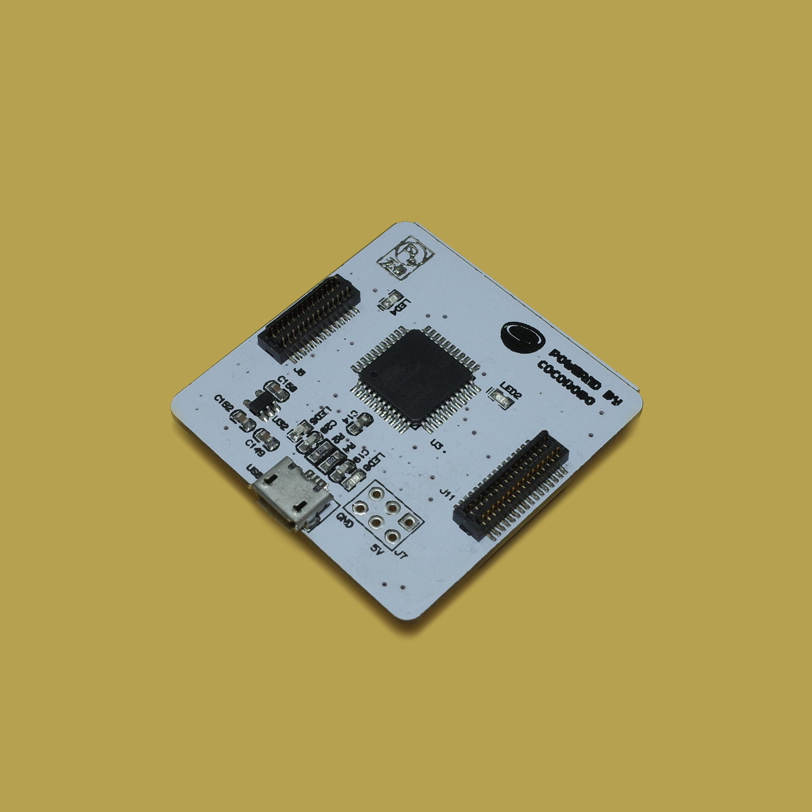

# 創意電子

---

## 課程簡介

用戶可以利用課程套件中的模組及對應的材料，結合 3D 打印和編程完成一個項目的製作。各個課程套件的主題都不盡相同，每個套件都依據各自的主題包含相對應的模組、傳感器和配件等材料物件，用戶通過學習相配套的課程，就能更好、更快地學習使用 CocoMod 電子模組。

## 課程大綱

<table>
   <tr>
      <td><strong>序號</td>
      <td><strong>單元</td>
      <td><strong>課程内容</td>
   </tr>
   <tr>
      <td>1</td>
      <td rowspan=3>基礎學習</td>
      <td>引入：創意電子交互藝術</td>
   </tr>
   <tr>
      <td>2</td>
      <td>認識電子模組和編程平臺，認識燈屏</td>
   </tr>
   <tr>
      <td>3</td>
      <td>小項目：玩轉燈屏，電子徽章</td>
   </tr>
   <tr>
      <td>4</td>
      <td rowspan=4>互動燈光</td>
      <td>呼吸燈 </td>
   </tr>
   <tr>
      <td>5</td>
      <td>變色燈</td>
   </tr>
   <tr>
      <td>6</td>
      <td>觸摸燈光</td>
   </tr>
   <tr>
      <td>7</td>
      <td>小項目：互動燈光游戲</td>
   </tr>
   <tr>
      <td>8</td>
      <td rowspan=4>電子樂器</td>
      <td>觸摸感應模組和音樂模組</td>
   </tr>
   <tr>
      <td>9</td>
      <td>MIDI 音樂</td>
   </tr>
   <tr>
      <td>10</td>
      <td>小項目：設計電子樂器（一）</td>
   </tr>
   <tr>
      <td>11</td>
      <td>小項目：設計電子樂器（二）</td>
   </tr>
   <tr>
      <td>12</td>
      <td rowspan=3>音樂繪本</td>
      <td>MP3 音樂模組</td>
   </tr>
   <tr>
      <td>13</td>
      <td>小項目：音樂繪本（一）</td>
   </tr>
   <tr>
      <td>14</td>
      <td>小項目：音樂繪本（二）</td>
   </tr>
   <tr>
      <td>15</td>
      <td rowspan=4>創意電子產品設計</td>
      <td>設計思維：創意電子</td>
   </tr>
   <tr>
      <td>16</td>
      <td>結題項目：創意電子作品設計和製作（一）</td>
   </tr>
   <tr>
      <td>17</td>
      <td>結題項目：創意電子作品設計和製作（二）</td>
   </tr>
   <tr>
      <td>18</td>
      <td>結題項目：創意電子作品設計和製作（三）</td>
   </tr>
   <tr>
      <td>19</td>
      <td rowspan=2>產品展示和評比</td>
      <td>作品展示</td>
   </tr>
   <tr>
      <td>20</td>
      <td>作品評比</td>
   </tr>
   <tr>
      <td></td>
      <td>選修模塊：燈帶</td>
      <td>1) 認識燈帶，學習連接方法，實現簡單效果 2)	實現走馬燈等複雜效果 3)	互動燈帶項目</td>
   </tr>
   <tr>
      <td></td>
      <td>選修模塊：多屏拼接</td>
      <td>1)	學習兩個 LED 燈屏的連接方法，實現簡單效果 2)	學習兩個以上 LED 燈屏的連接方法，實現較爲複雜的動畫效果 3)	多屏動畫效果</td>
   </tr>
   <tr>
      <td></td>
      <td>選修模塊：猜拳神器</td>
      <td>1)	深入學習觸摸感應模組，條件判斷語句、變量、隨機數 2)	互動項目：猜拳神器</td>
   </tr>
   <tr>
      <td></td>
      <td>選修模塊：游戲手柄</td>
      <td>1)	觸摸和游戲手柄 2)	互動項目：手柄和 scratch 小游戲</td>
   </tr>
</table>

## 模組介紹

材料包中所包含的模組請見下表：

|No. |模組 | 圖片 |簡介 | 詳細介紹 |
|-  |-  |-  |- |- |
|1. | 主機板模組  |  | 如果將電子模組類比爲人的身體，主機板模組就是電子模組的「大腦」(brain)， 我們在CocoBlockly中撰寫的程式則是主機板模組「大腦」思考要做什麼動作或 發出什麼指令時產生的各種「想法」；當「想法」傳輸至「大腦」後，主機板 模組從而控制其他模組並令其做出相應的動作或指令。 | [此頁面](/cocomod/main-controller) |
|2. | LED 燈屏模組  |  | LED 燈屏模組是將多個 LED 燈排列一起而成的電子模組，我們可以通過點亮不 同的燈，用不同的顏色，去繪製自己想要的圖案 | [此頁面](/cocomod/led-matrix) |
|3. | 音樂模組  |  | 音樂模組為播放樂器聲音和音樂文檔所用，音樂模組可以發出超過 100 種樂器 的聲音，模組也有1個 SD 卡擴展插口，支援播放 .ogg 或者 .mp3 的音樂檔。 目前版本的 CocoBlockly 中，我們已經支持使用者通過音樂模組，演奏出不同 樂器的聲音，以及播放單個音樂文件。 | [此頁面](/cocomod/music) |
|4. | 觸摸感應模組  |  | 觸摸感應模組通常與導電紙同用，可以通過觸摸接口或者與接口相連的導電紙 来向模組發送一個電位訊號，這樣的電訊號就可以表示觸摸的位置。 | [此頁面](/cocomod/touch) |

## 迷你燈光電子琴組裝

### 準備材料

電子模組：

- 主機板模組
- 音樂模組
- LED 燈屏模組
- 觸碰感應模組

3D打印材料：
- 白色琴鍵 x 7
- 黑色琴鍵 x 5
- 琴身組件：電子琴底座、模組支架、模組容器

工具：
- 剪線鉗
- 導電紙

### 組裝步驟

1. 首先，用剪線鉗將杜邦線的一頭去掉，露出大約2-3cm的銅絲。

2. 將處理過的杜邦線全部接到觸碰感應模組中。

3. 將4個電子模組組合起來。由上到下，分別是 LED 燈屏模組，主機板模組，觸碰感應模組和音樂模組。

4. 然後，將杜邦線從電子琴底部的孔中穿過去。從左至右，杜邦線對應在觸摸感應上的引針的數位編號爲從0到11。

5. 將杜邦線中暴露出來的銅絲穿過白色琴鍵（或黑色琴鍵）中的孔。

6. 剪下一塊尺寸合適的導電紙，並且和銅絲一起貼在琴鍵上。

7. 此步驟重複至所有琴鍵觸摸設置完成。

8. 將電子模組放入模組容器中。

9. 最後，將模組容器穿過模組支架，並且將支架固定在電子琴底座上。

10. 迷你燈光電子琴組裝完成。

11. 完整的迷你燈光電子琴就如下圖。

## 迷你電子琴編程

前往 [CocoBlockly](https://cocorobo.hk/cocoblockly/dev/?lang=zh-hant)，使用「音樂」一欄的積木，完成迷你電子琴的程式設計，上傳至主機板模組後即可出現電子琴的效果

###### Send your question to  [it@cocorobo.hk](http://cocorobo.hk/online/)  for support

***

更新日期：2019年8月
