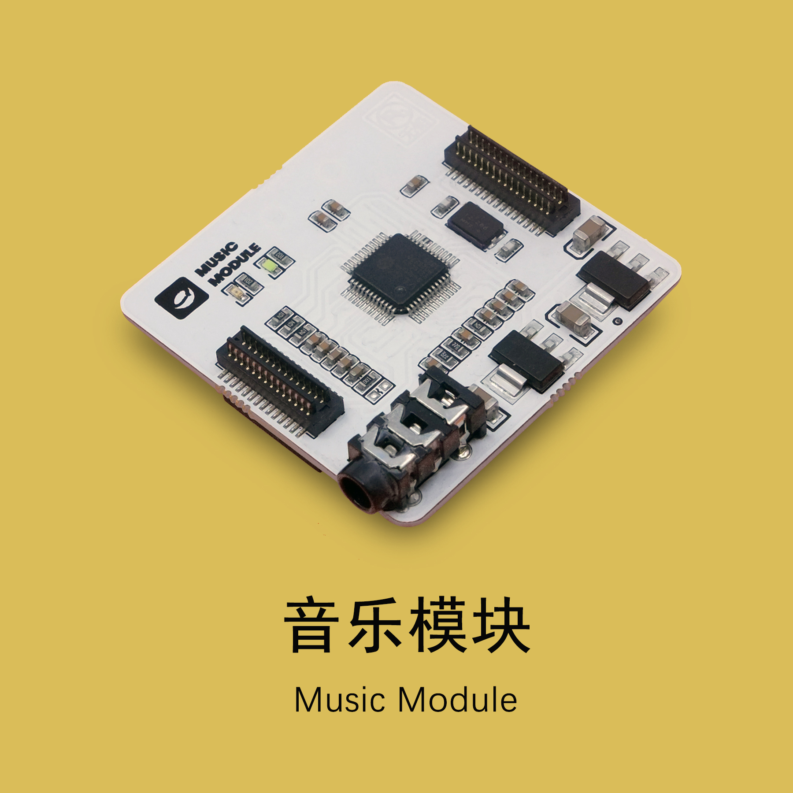

# 创意电子

---

## 课程简介

学生可以利用课程套件中的模块及对应的材料，结合 3D 打印和编程完成一个项目的制作。各个课程套件的主题都不尽相同，每个套件都依据各自的主题包含相对应的模块、传感器和配件等材料物件，学生通过学习相配套的课程，就能更好、更快地学习使用 CocoMod 电子模块。

## 课程大纲

<table>
   <tr>
      <td><strong>序号</td>
      <td><strong>单元</td>
      <td><strong>课程内容</td>
   </tr>
   <tr>
      <td>1</td>
      <td rowspan=3>基础学习</td>
      <td>引入：创意电子交互艺术</td>
   </tr>
   <tr>
      <td>2</td>
      <td>认识电子模块和编程平台，认识灯屏</td>
   </tr>
   <tr>
      <td>3</td>
      <td>小项目：玩转灯屏，电子徽章</td>
   </tr>
   <tr>
      <td>4</td>
      <td rowspan=4>互动灯光</td>
      <td>呼吸灯 </td>
   </tr>
   <tr>
      <td>5</td>
      <td>变色灯</td>
   </tr>
   <tr>
      <td>6</td>
      <td>触摸灯光</td>
   </tr>
   <tr>
      <td>7</td>
      <td>小项目：互动灯光游戏</td>
   </tr>
   <tr>
      <td>8</td>
      <td rowspan=4>电子乐器</td>
      <td>触摸传感模块和音乐模块</td>
   </tr>
   <tr>
      <td>9</td>
      <td>MIDI 音乐</td>
   </tr>
   <tr>
      <td>10</td>
      <td>小项目：设计电子乐器（一）</td>
   </tr>
   <tr>
      <td>11</td>
      <td>小项目：设计电子乐器（二）</td>
   </tr>
   <tr>
      <td>12</td>
      <td rowspan=3>音乐绘本</td>
      <td>MP3 音乐模块</td>
   </tr>
   <tr>
      <td>13</td>
      <td>小项目：音乐绘本（一）</td>
   </tr>
   <tr>
      <td>14</td>
      <td>小项目：音乐绘本（二）</td>
   </tr>
   <tr>
      <td>15</td>
      <td rowspan=4>创意电子产品设计</td>
      <td>设计思维：创意电子</td>
   </tr>
   <tr>
      <td>16</td>
      <td>结题项目：创意电子作品设计和制作（一）</td>
   </tr>
   <tr>
      <td>17</td>
      <td>结题项目：创意电子作品设计和制作（二）</td>
   </tr>
   <tr>
      <td>18</td>
      <td>结题项目：创意电子作品设计和制作（三）</td>
   </tr>
   <tr>
      <td>19</td>
      <td rowspan=2>产品展示和评比</td>
      <td>作品展示</td>
   </tr>
   <tr>
      <td>20</td>
      <td>作品评比</td>
   </tr>
   <tr>
      <td>选修模块</td>
      <td>灯带</td>
      <td>1) 认识灯带，学习连接方法，实现简单效果 2)	实现走马灯等复杂效果 3)	互动灯带项目</td>
   </tr>
   <tr>
      <td>选修模块</td>
      <td>多屏拼接</td>
      <td>1)	学习两个 LED 灯屏的连接方法，实现简单效果 2)	学习两个以上 LED 灯屏的连接方法，实现较为复杂的动画效果 3)	多屏动画效果</td>
   </tr>
   <tr>
      <td>选修模块</td>
      <td>猜拳神器</td>
      <td>1)	深入学习触摸传感模块，条件判断语句、变量、随机数 2)	互动项目：猜拳神器</td>
   </tr>
   <tr>
      <td>选修模块</td>
      <td>游戏手柄</td>
      <td>1)	触摸和游戏手柄 2)	互动项目：手柄和 scratch 小游戏</td>
   </tr>
</table>

## 模块介绍

本课程套件所涉及的模块请见下表：

|No. |模块 | 图片 |简介 | 详细介绍 |
|-  |-  |-  |- |- |
|1. | 主控模块  |  | 如果将电子模块模拟为人的身体，主控模块就是电子模块的「大脑」(brain)， 我们在CocoBlockly中撰写的程序则是主控模块「大脑」思考要做什么动作或 发出什么指令时产生的各种「想法」；当「想法」传输至「大脑」后，主控 模块从而控制其他模块并令其做出相应的动作或指令。 | [此页面](/cocomod/main-controller) |
|2. | LED 灯屏模块  |  | LED 灯屏模块是将多个 LED 灯排列一起而成的电子模块，我们可以通过点亮不 同的灯，用不同的颜色，去绘制自己想要的图案 | [此页面](/cocomod/led-matrix) |
|3. | 音乐模块  |  | 音乐模块为播放乐器声音和音乐文档所用，音乐模块可以发出超过 100 种乐器 的声音，模块也有1个 SD 卡扩展插口，支援播放 .ogg 或者 .mp3 的音乐档。 目前版本的 CocoBlockly 中，我们已经支持使用者通过音乐模块，演奏出不同 乐器的声音，以及播放单个音乐文件。 | [此页面](/cocomod/music) |
|4. | 触摸传感模块  |  | 触摸传感模块通常与导电纸同用，可以通过触摸接口或者与接口相连的导电纸 来向模块发送一个电位信号，这样的电信号就可以表示触摸的位置。 | [此页面](/cocomod/touch) |

## 迷你灯光电子琴组装

### 准备材料

电子模块：

- 主控模块
- 音乐模块
- LED 灯屏模块
- 触碰传感模块

3D打印材料：
- 白色琴键 x 7
- 黑色琴键 x 5
- 琴身组件：电子琴底座、模块支架、模块容器

工具：
- 剪线钳
- 导电纸

### 组装步骤

1. 首先，用剪线钳将杜邦线的一头去掉，露出大约2-3cm的铜丝。

2. 将处理过的杜邦线全部接到触碰传感模块中。

3. 将4个电子模块组合起来。由上到下，分别是 LED 灯屏模块，主控模块，触碰传感模块和音乐模块。

4. 然后，将杜邦线从电子琴底部的孔中穿过去。从左至右，杜邦线对应在触摸传感上的引针的数字编号为从0到11。

5. 将杜邦线中暴露出来的铜丝穿过白色琴键（或黑色琴键）中的孔。

6. 剪下一块尺寸合适的导电纸，并且和铜丝一起贴在琴键上。

7. 此步骤重复至所有琴键触摸设置完成。

8. 将电子模块放入模块容器中。

9. 最后，将模块容器穿过模块支架，并且将支架固定在电子琴底座上。

10. 迷你灯光电子琴组装完成。

11. 完整的迷你灯光电子琴就如下图。

## 迷你电子琴编程

前往 [CocoBlockly](https://cocorobo.cn/cocoblockly/dev/?lang=zh-hant)，使用「音乐」一栏的积木，完成迷你电子琴的程序设计，上传至主控模块后即可出现电子琴的效果

###### 若您有其他疑问，请电邮至 support@cocorobo.cc 询问

***

更新日期：2019年8月
