# 課程套件使用說明
## 關於CocoBlockly
　　CocoMod™ 是一系列由 CocoRobo 研發的「隨插即用式」的電子模組，目前已研發 15 餘款，其中控制類模組 2 種，輸入類模組 7 種，輸出類模組 7 種，轉接類模組 6 種。CocoMod™ 可以讓你的作品能夠擁有感應、控制真實世界的能力，只要接上各種輸入/輸出模組或元件， 例如 LED 燈、馬達、開關、溫溼度感應器、顯示裝置，或是接上無線通訊模組，就可以做出各式各樣的小發明。

　　用戶利用這些模組，結合 3D 列印和編程可以輕鬆地完成各類項目，其擴展性較市面上其他多數 Arduino 套件更適合入門者學習電子及編程知識。同時，CocoRobo鼓勵用戶通過配套的課程，來更好、更快的學習使用 CocoMod™ 電子模組。
## 什麼是CocoBlockly 
### 界面介紹
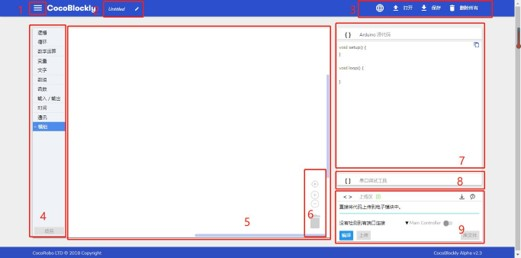 

1. 菜單欄 ：關於 CocoBlockly 的所有資訊都可從這裏找到，如使用教程、版本更新或者用戶反饋

2. 程式檔案名稱 ：當前正在編輯的程式檔案的名稱，會成爲下載後的程式檔案名

3. 通用工具欄 ：包含「切換語言」、「打開／保存程式檔案」、「刪除所有積木」4 種功能

4. 積木功能欄 ：所有積木從這個功能欄中拖取，並分「基礎 Block」和「CocoMod™」兩類

5. 積木設計區 ：將積木拖進該區域進行編程，點擊空白部分可以拖拽整個區域

6. 積木設計區工具欄 ：包含「視角重置」「放大／縮小視角」「刪除單個積木」功能

7. 積木對應原始碼參考區 :「積木設計區」生成的原始碼（C 語言），一般情況並不會用到

8. 序列埠調試工具區：配合「程式上傳區」對電子模組進行調試

9. 程式上傳區：最重要的部分，點擊 Uploader 展開整個區域，我們在此處將程式上傳至電子模組中
###　積木功能欄介紹
在 CocoBlockly 中，積木功能欄分爲兩部分，一部分爲編程所需的基本積木（如循環語句、邏輯語句等），另外一部分則是針對CocoMod™ 電子模組設計的功能積木，例如要控制馬達/馬達時，只需前往馬達/電機驅動模組對應的欄拖拽所需積木至工作區即可。

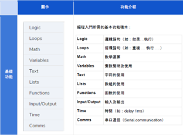 　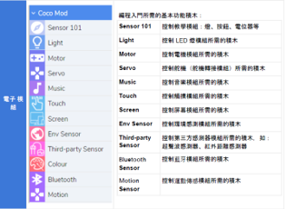 

## Uploader下載及安裝

爲了能夠讓 CocoBlockly 能夠從瀏覽器和主機板模組進行通訊，我們推出一款跨平臺的「上傳外掛程式（Uploader）」，用戶只需要下載該外掛程式，安裝即可對我們的電子模組上傳程式。首先，請選擇對應的操作系統，下載CocoBlockly Uploader 安裝包。

1. 安裝包下載

穩定版本： CocoBlockly Uploader Version1.0.0 – alpha

|操作系統|下載|語言|系統要求|
|- |- |- |- |
|MacOS|[下載地址](https://cocorobo.hk/downloads/CocoBlocklyUploader_macOS.zip)|繁體中文|要求系統版本高於10.10|
|Windows|[下載地址](https://cocorobo.hk/downloads/CocoBlocklyUploader_Windows.zip)|繁體中文|要求系統版本高於 Windows 7|

* MacOS

1.下載完成後，雙擊名字以「CocoBlocklyUploader」開頭的 .dmg 安裝文件

2.打開後，將「CocoBlockly Uploader」拖入右側的「Applications」文件夾中

3.隨後可能會需要輸入您的賬戶密碼，授權進行安裝。安裝完成後，雙擊右下角的「Applications」，進入應用程式文件夾

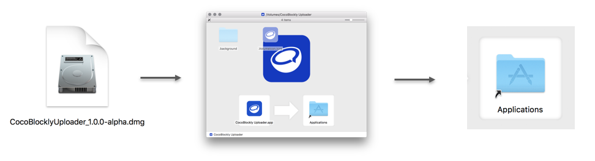 

4.找到「CocoBlockly Uploader」，右鍵該文件，點擊打開

5.此時可能會彈出一個窗口，提示該應用會與互聯網進行通訊，是否允許，點擊「允許」

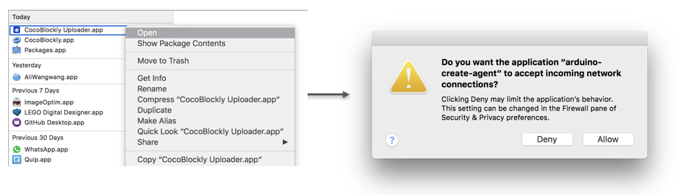 

6.至此，完成 CocoBlockly Uploader 的安裝，用戶可以點擊系統菜單欄的 CocoBlockly 圖標，前往開發環境界面http://cocorobo.hk/cocoblockly/dev/
   
7.打開 CocoBlockly 後，會提示「上傳外掛程式連接成功」，即可以開始上傳 Blockly 程式到主機板上

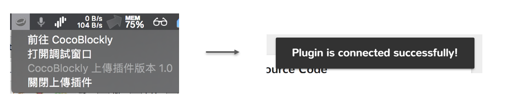 

* Windows

1.下載完成後，雙擊名字以「CocoBlocklyUploader」開頭的 EXE 安裝文件

2.打開後，可以選擇軟件安裝的位置，然後點擊「下一步 (Next)」

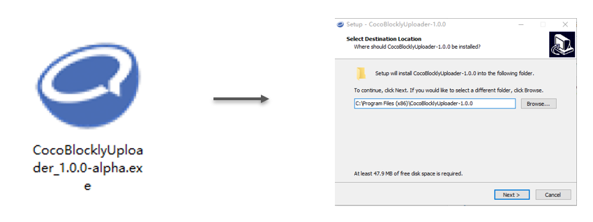 

3.可以看到一些選項：第一個是創建一個快捷方式在電腦桌面；第二個是選擇是否在電腦開機後自動開啓「CocoBlockly Uploader」完成選擇後，再點擊「下一步 (Next)」進行下一步；在這個接口，可以看到之前選擇的安裝位置和安裝選擇，最後點擊「安裝 (Install)」就可以開始安裝

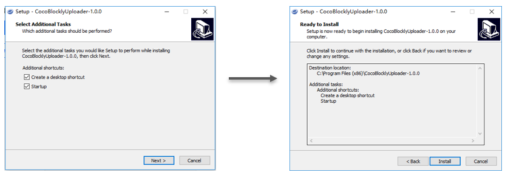 

4.點擊「完成 (Finish)」以完成「CocoBlockly Uploader」安裝程式。用戶可以點擊系統菜單欄的 CocoBlockly 圖標，前往開發環境界面：http://cocorobo.hk/cocoblockly/dev/

5.打開「CocoBlockly」後，會提示「上傳外掛程式連接成功」，即可以開始上傳 Blockly 程式到主機板上

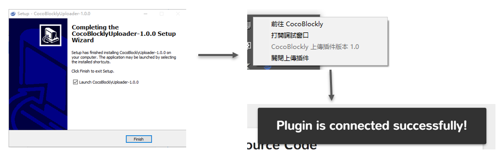 

## 使用新版上傳插件
　　爲了讓用戶在 CocoBlockly 中能夠將拼好的積木程式，更高效地上傳至「主機板模組」中，我們研發了一款新的上傳插件，
用戶安裝該系統 插件以後，只需打開該插件，前往 CocoBlockly 即可開始使用。插件的下載及安裝過程可以前往以下頁面
進行了解：https://cocorobolabs.gitbooks.io/cocoblockly/content/uploader-xia-zai-ji-an-zhuang.html

　　插件安裝完成後，按照如下指示操作即可對主機板模組進行程式上傳，或者查看視頻瞭解：https://vimeo.com/264907493

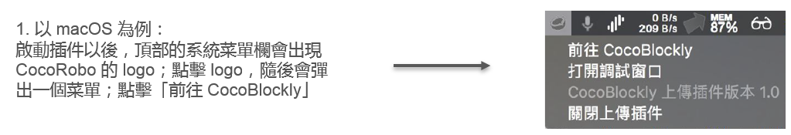 

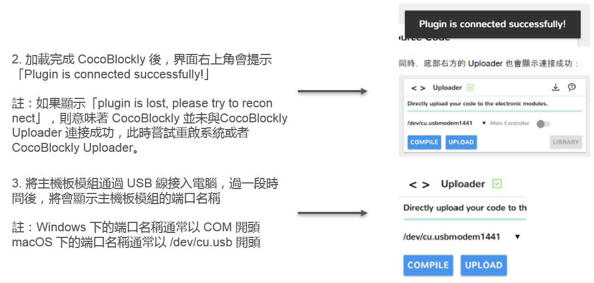 

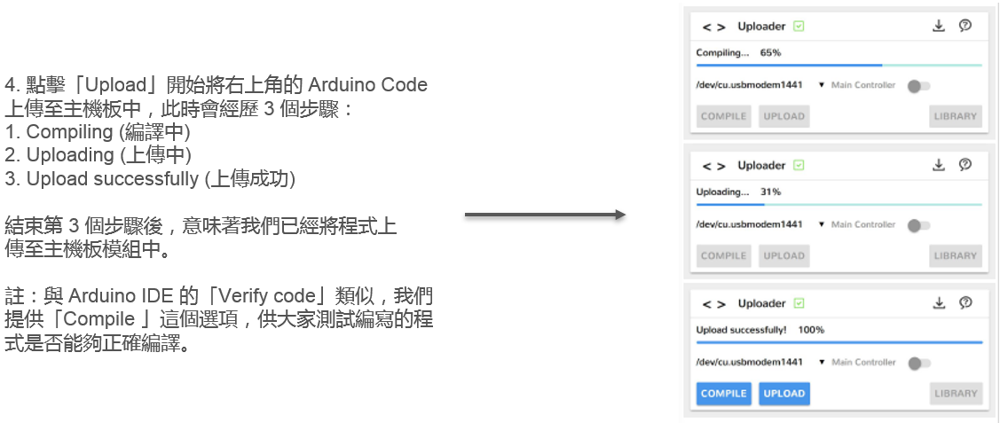 
