# 机械达人
---
## 模块介绍
- [主控模块](/cocomod/main-controller)
- [教学模块](/cocomod/sensor-101)
- [伺服电机模块](/cocomod/servo)
- [蓝牙模块](/cocomod/bluetooth)
## 双足机械人的组装
### 准备材料
电子模块及零配件：
- 主控模块 1 个
- 伺服电机模块 1 个
- 9g 伺服电机 4 个
- USB 线 1 条

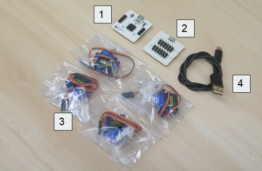

3D 打印材料：
- 机械人身子
- 机械人腿部
- 机械人足部
- 机械人上盖

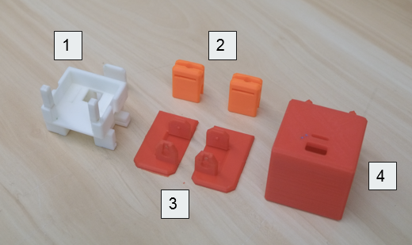
### 上半身组装
1.拿出蓝色的 9g 伺服电机，和配套的零件

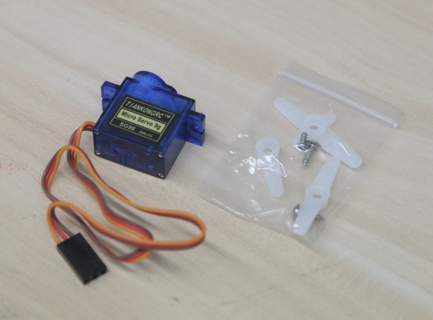

2.将 9g 伺服电机放进机械人上身模型，如下图所示

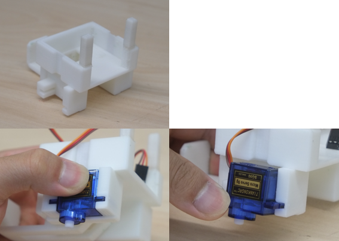

3.同样地，拿出另外一个 9g 伺服电机放进机械人上身模型的另一侧

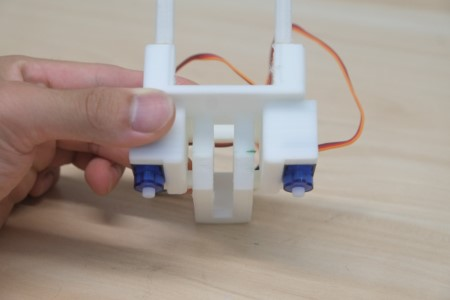

4.拿出伺服电机配套白色的固定盘（如下图），将固定盘放在伺服电机上，随后进行伺服电机的角度校准，我们将要把固定盘放在伺服电机位于 90 度的位置上，方法如下：
- 往伺服电机插上固定盘
- 向左转动至底，取出；
- 再将固定盘以垂直于伺服电机顶面长的那一边，插在伺服电机上，如图1
- 顺时针转 90 度，完成基础校准，如图2

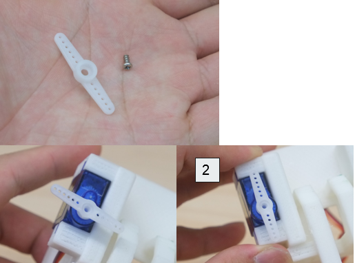

5.拿出伺服电机配套的螺丝（最短的那种）拧紧在固定盘上

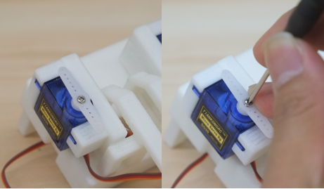

6.按照相同的方法，安装另一侧的伺服电机

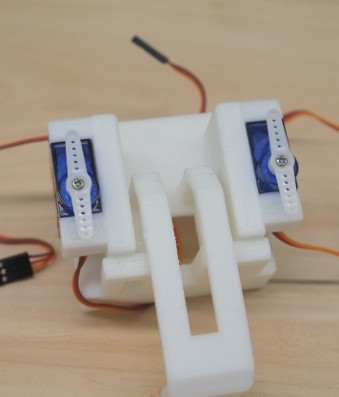
### 下半身组装
1.拿出下半身的零件，开始安装腿部，此图中为橙色的部分

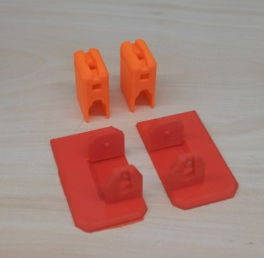

2.将腿部部件的顶部，安置在伺服电机的固定盘上

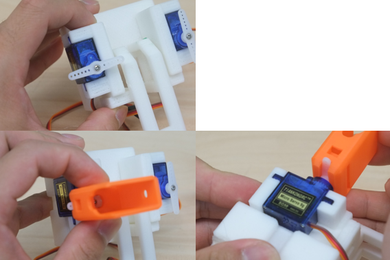

3.用伺服电机配套的长螺丝，拧紧在伺服电机的固定盘上，即右边绿圈处

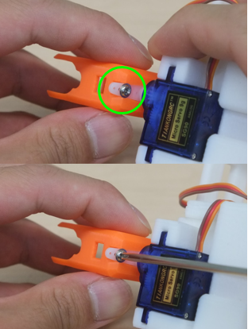

4.转动伺服电机 180 度，将另一边也用长螺丝拧紧固定盘

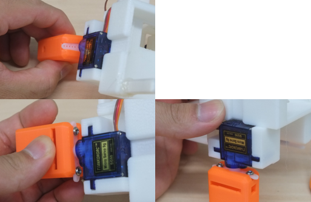

5.用相同的方法，把另一只腿也固定好

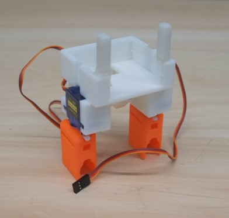

6.再次拿出一个伺服电机，如右图所示，放进腿部

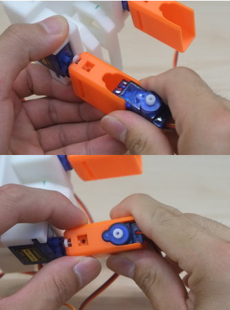

7.使用长螺丝，将长螺丝拧紧至腿部侧边的孔，固定住刚刚的伺服电机

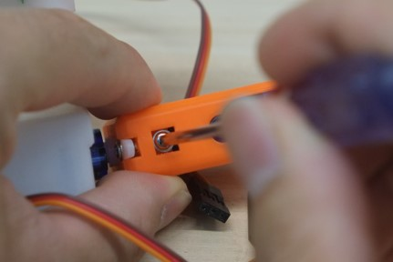

8.用同样的方法，将最后一个伺服电机放进另一只腿中

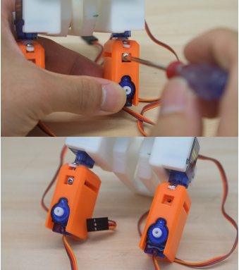

9.至此，完成腿部模型的组装

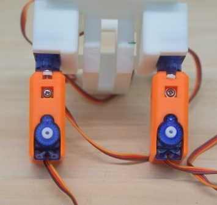

10.拿出伺服电机配套的另一种固定盘，即 one-sided，插进腿部的伺服电机，按照开始说的方法，将伺服电机的原始角度设置在平行于伺服电机顶面长边，即下图所示

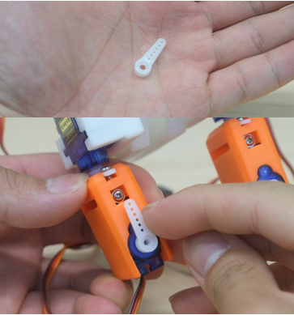

11.拿出足部的模型件

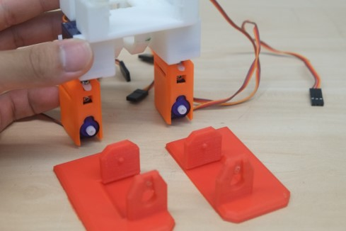

12.将腿部部分，放进足部模型件

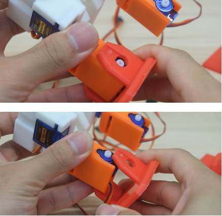

13.将腿部部分放进足部模型件后，把固定盘插在伺服电机上，如绿圈所示。完成后，用同样地方法，把另一只足也完成组装

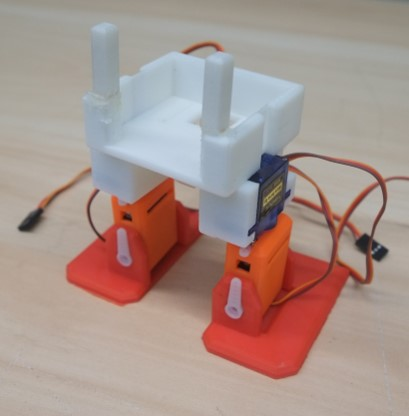

14.拿出电子模块：主控模块和伺服电机模块，将两个模块插在一起

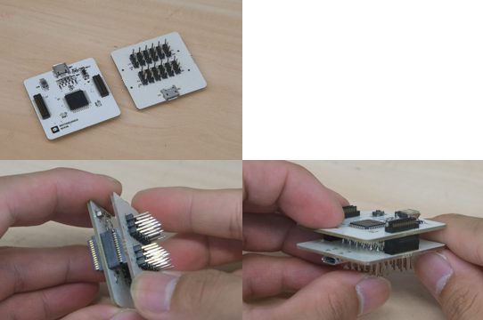

15.记住下图的伺服电机顺序，上面的编号会是我们要从程序方面设置的控制端口位（pinouts）

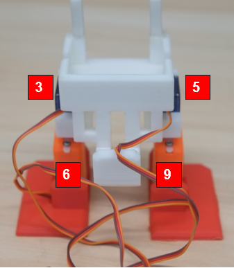

16.伺服电机模块共有 6 组控制端口，为 D(3~13), VCC, GND，分别对应「信号控制端口」、「正极」和「负极」，按照顺序，将伺服电机的线对应连接在伺服电机模块上的 3, 5, 6, 9 处。

   注意！切勿接反！请参考下图连接

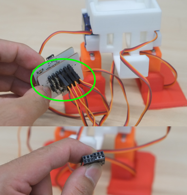
### 完成组装
将模块插在机械人身体模型件上，至此完成双足机械人的组装！

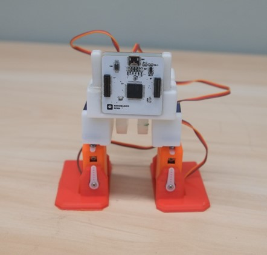
## 双足机械人编程
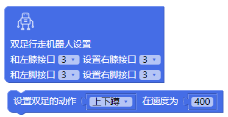

前往 CocoBlockly，在「伺服电机」那栏拖入如上图所示的两个积木，改动第一个空以改变双足的行动动作

###### Send your question to [it@cocorobo.cn](http://cocorobo.cn/online/) for support
