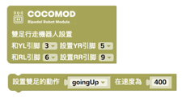
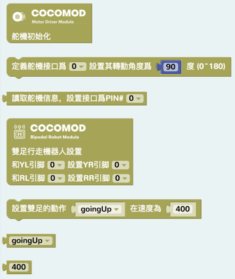

# 機械達人
---
## 模組介紹
- [主機板模組](/cocomod/main-controller)
- [教學模組](/cocomod/sensor-101)
- [伺服馬達模組](/cocomod/servo)
- [藍牙模組](/cocomod/bluetooth)
## 雙足機械人的組裝
### 準備材料
電子模組及零配件：
- 主機板模組 1 個
- 伺服馬達模組 1 個
- 9g 伺服馬達 4 個
- USB 線 1 條

3D 打印材料：
- 機械人身子
- 機械人腿部
- 機械人足部
- 機械人上蓋

### 上半身組裝
1.拿出藍色的 9g 伺服馬達，和配套的零件

2.將 9g 伺服馬達放進機械人上身模型，如下圖所示

3.同樣地，拿出另外一個 9g 伺服馬達放進機械人上身模型的另一側

4.拿出伺服馬達配套白色的固定盤（如下圖），將固定盤放在伺服馬達上，隨後進行伺服馬達的角度校準，我們將要把固定盤放在伺服馬達位於 90 度的位置上，方法如下：
- 往伺服馬達插上固定盤
- 向左轉動至底，取出；
- 再將固定盤以垂直於伺服馬達頂面長的那一邊，插在伺服馬達上，如圖1
- 順時針轉 90 度，完成基礎校準，如圖2

5.拿出伺服馬達配套的螺絲（最短的那種）擰緊在固定盤上

6.按照相同的方法，安裝另一側的伺服馬達

### 下半身組裝
1.拿出下半身的零件，開始安裝腿部，此圖中爲橙色的部分

2.將腿部部件的頂部，安置在伺服馬達的固定盤上

3.用伺服馬達配套的長螺絲，擰緊在伺服馬達的固定盤上，即右邊綠圈處

4.轉動伺服馬達 180 度，將另一邊也用長螺絲擰緊固定盤

5.用相同的方法，把另一隻腿也固定好

6.再次拿出一個伺服馬達，如右圖所示，放進腿部

7.使用長螺絲，將長螺絲擰緊至腿部側邊的孔，固定住剛剛的伺服馬達

8.用同樣的方法，將最後一個伺服馬達放進另一隻腿中

9.至此，完成腿部模型的組裝

10.拿出伺服馬達配套的另一種固定盤，即 one-sided，插進腿部的伺服馬達，按照開始說的方法，將伺服馬達的原始角度設置在平行於伺服馬達頂面長邊，即下圖所示

11.拿出足部的模型件

12.將腿部部分，放進足部模型件

13.將腿部部分放進足部模型件後，把固定盤插在伺服馬達上，如綠圈所示。完成後，用同樣地方法，把另一隻足也完成組裝

14.拿出電子模組：主機板模組和伺服馬達模組，將兩個模組插在一起

15.記住下圖的伺服馬達順序，上面的編號會是我們要從程式方面設置的控制端口位（pinouts）

16.伺服馬達模組共有 6 組控制端口，爲 D(3~13), VCC, GND，分別對應「訊號控制端口」、「正極」和「負極」，按照順序，將伺服馬達的線對應連接在伺服馬達模組上的 3, 5, 6, 9 處。
   
   注意！切勿接反！請參考下圖連接
   

### 完成組裝
將模組插在機械人身體模型件上，至此完成雙足機械人的組裝！

## 雙足機械人編程

前往 CocoBlockly，在「伺服馬達」那欄拖入如上圖所示的兩個積木，改動第一個空以改變雙足的行動動作

###### Send your question to [it@cocorobo.hk](http://cocorobo.hk/online/) for support
