# 動力小車
---
## 模組介紹
- [主機板模組](/cocomod/main-controller)
- [教學模組](/cocomod/sensor-101)
- [伺服馬達模組](/cocomod/servo)
- [藍牙模組](/cocomod/bluetooth)
## 迷你小車的組裝
### 準備材料
電子模組：
- 主機板模組
- 電機驅動模組

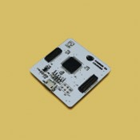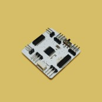

3D打印材料：
- 小車車身
- 小車車蓋
- 超聲波固定架
- 紅外傳感器固定架
- 車輪 x 2
- 萬向輪
- 萬向輪固定架

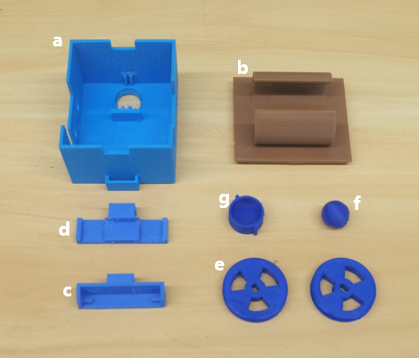

零件&工具：
- 電機 x 2
- 輪胎 x 2
- 螺絲 x 4
- 螺母 x 4（optional）
- 螺絲刀

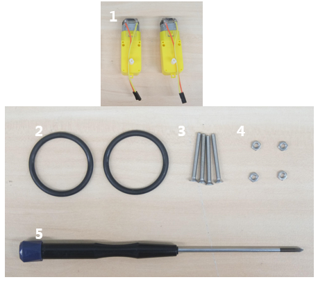
### 組裝萬向輪
將萬向輪放入小車車身的圓孔中，然後再安上萬向輪固定架;將小車輪胎套到小車車輪上。

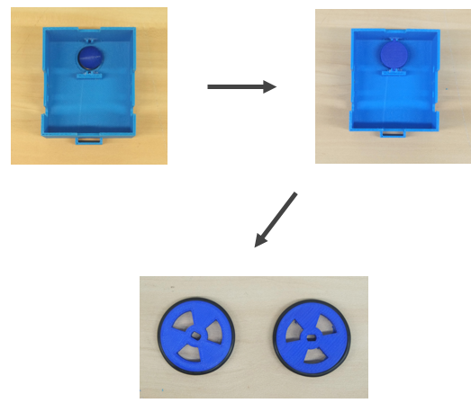
### 組裝電機
- 將兩個電機按照右圖的方式放置在小車車身的兩側。

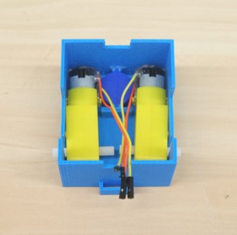
- 用螺絲穿過車身側邊的小孔和電機的小孔，固定住一側的電機的位置。

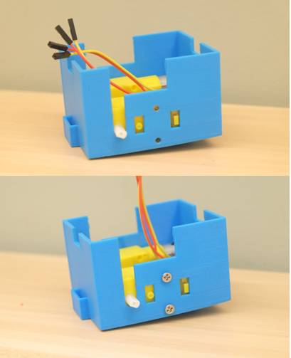

如果螺絲不能很好地固定電機，可以用螺母鎖住螺絲，使電機更加穩固。

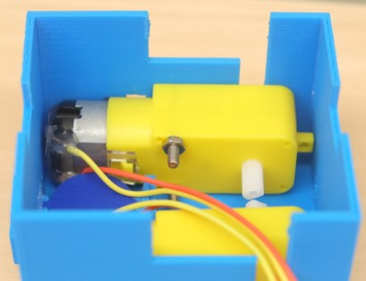
- 用相同的方式固定住另外一側的電機，就完成了電機的組裝。

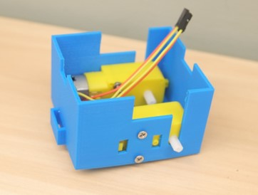
### 組裝車輪
將車輪安裝在兩側的電機上。

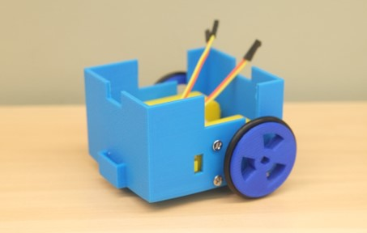
### 裝配電子模組
將電機驅動模組安在主控模組上面（如圖1）。

將電機的杜邦綫接在電機驅動模組的A和B位置上的引針（見圖2）。

將電子模組放置在車身上（見圖3）。

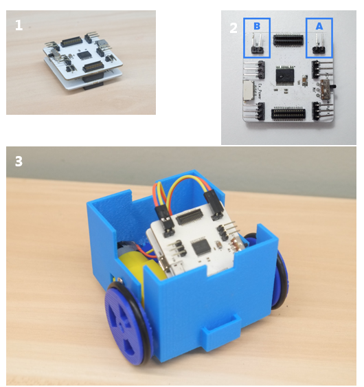
### 完成組裝
將車蓋合上就完成小車的組裝啦！

可以在車頭或者車尾的位置添加超聲波固定架或紅外傳感器固定架，支持超身波小車和紅外綫小車。

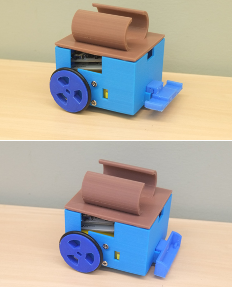
## 小車方向控制編程
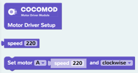

前往 CocoBlockly，點擊「電機」，拖入右側的積木來完成「向前、左轉、右轉、向後」的動作

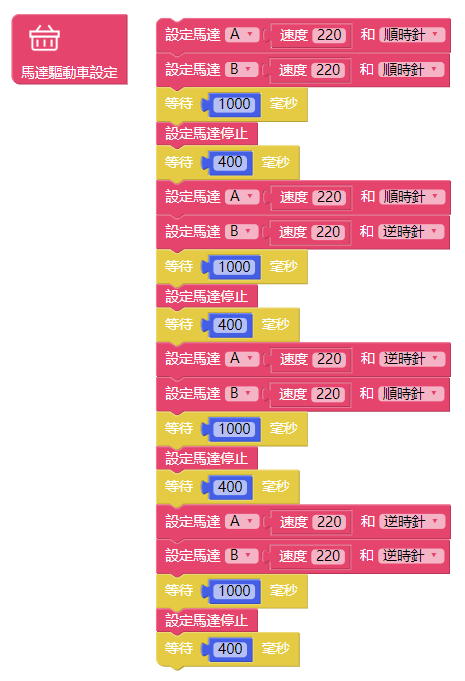

###### Send your question to [it@cocorobo.hk](http://cocorobo.hk/online/) for support