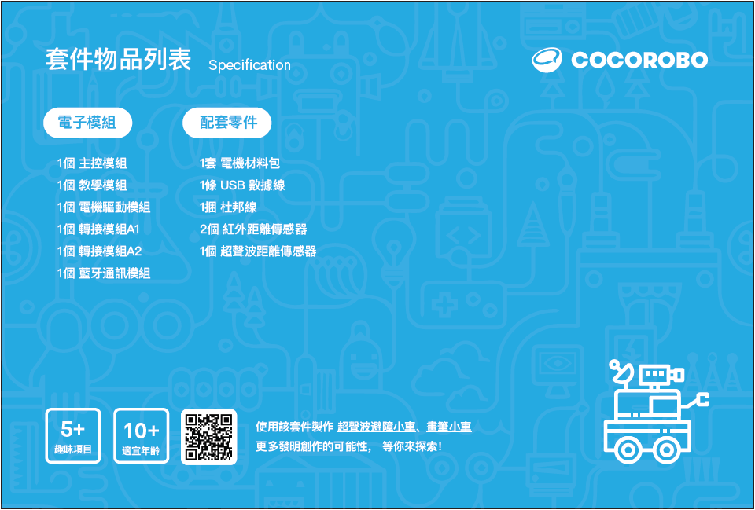

# Robot Car

---

## Course Introduction

"Robot Car" is one of the basic courses of the CocoRobo STEAM system. In the course, students will use robot car as a learning and research object, from which they learn how to use electronic modules, to write controlling programs and to apply rapid manufacturing technologies such as 3D printing. Students design and establish robot cars from scratch and show their products in the competition at the end of the course.

## Syllabus

<table>
   <tr>
      <td><strong>No.</td>
      <td><strong>Unit</td>
      <td><strong>Contents</td>
   </tr>
   <tr>
      <td>1</td>
      <td rowspan=3>Basic Knowledge</td>
      <td>Introduction: The world of cars; learn about cars</td>
   </tr>
   <tr>
      <td>2</td>
      <td>Learn electronic modules and programming platform (1)</td>
   </tr>
   <tr>
      <td>3</td>
      <td>Learn electronic modules and programming platform (2)</td>
   </tr>
   <tr>
      <td>4</td>
      <td rowspan=3>Power of the car - motor drive</td>
      <td>Motor and motor drive borad</td>
   </tr>
   <tr>
      <td>5</td>
      <td>Program-driven motor and controlling two motors</td>
   </tr>
   <tr>
      <td>6</td>
      <td>Project: Motor's rotating direction and speed adjustment</td>
   </tr>
   <tr>
      <td>7</td>
      <td rowspan=3>The structure of car - paper car</td>
      <td>The structure of car</td>
   </tr>
   <tr>
      <td>8</td>
      <td>Project: make a paper car (1)</td>
   </tr>
   <tr>
      <td>9</td>
      <td>Project: make a paper car (2)</td>
   </tr>
   <tr>
      <td>10</td>
      <td rowspan=3>Controlling a car - avoid obstacle with ultrasound</td>
      <td>Use ultrasound to detect distance Anti rear-ending car/reversing radar</td>
   </tr>
   <tr>
      <td>11</td>
      <td>Project: Make an anti rear-ending car (1)</td>
   </tr>
   <tr>
      <td>12</td>
      <td>Project: Make an anti rear-ending car (2)</td>
   </tr>
   <tr>
      <td>13</td>
      <td rowspan=4>The structure of car - rapid manufacturing technologies</td>
      <td>Rapid manufacturing technologies: 3D modeling and 3D printing</td>
   </tr>
   <tr>
      <td>14</td>
      <td>Rapid manufacturing technologies: 2D modeling and laser cutting </td>
   </tr>
   <tr>
      <td>15</td>
      <td>Project: Make a car with rapid manufacturing technologies (1)</td>
   </tr>
   <tr>
      <td>16</td>
      <td>Project: Make a car with rapid manufacturing technologies (2)</td>
   </tr>
   <tr>
      <td>17</td>
      <td rowspan=4>Competition of cars</td>
      <td>Competition rules</td>
   </tr>
   <tr>
      <td>18</td>
      <td>Make a car for the competition (1)</td>
   </tr>
   <tr>
      <td>19</td>
      <td>Make a car for the competition (2)</td>
   </tr>
   <tr>
      <td>20</td>
      <td>Hold the competition</td>
   </tr>
   <tr>
      <td>Optional Modules</td>
      <td>Controlling car - tracking car</td>
      <td>1) Make a tracking car with infrared sensor 2)	Competition of tracking cars</td>
   </tr>
   <tr>
      <td>Optional Modules</td>
      <td>Bumper car - the structure of sumo car</td>
      <td>1)	Make a bumper car 2)	Competition of bumper cars</td>
   </tr>
   <tr>
      <td>Optional Modules</td>
      <td>Bluetooth remote control car</td>
      <td>Make a Bluetooth remote control car</td>
   </tr>
   <tr>
      <td>Optional Modules</td>
      <td>Floor-sweeping robot</td>
      <td>Make a floor-sweeping car</td>
   </tr>
</table>

## Module Instruction

The following table shows the modules involved in this course kit:

|No. |Modules | Pictures |Introduction | Details |
|-  |-  |-  |- |- |
|1. | Main Controller  |  | Main Controller can be regarded as "the brain" if electronic modules were the human body. Programs written in CocoBlockly are "the ideas" aiming to tell "the brain" (main controller) what to do. Once "the ideas" are transmitted to "the brain", the main controller will control other modules to do what is commanded. | [Click here](/cocomod/main-controller) |
|2. | Sensor 101 Module  |  | Sensor 101 module, an input/output module of the CocoMod, can facilitate students in learning the basic knowledge of electronics and Arduino. | [Click here](/cocomod/sensor-101) |
|3. | Motor Driver Module  |  | Motor driver module can control two motors simultaneously. And it is equipped with four sensor pinouts, which can be used to connect to third-party sensors. | [Click here](/cocomod/motor-driver) |
|4. | Hub Module A1/A2  |  | There are several groups of pinouts in the hub module. They serve as adaptor for either external equipment such as motor and servo motor, or third-party sensors such as infrared sensors and ultrasonic sensors. Each group consists of ground (GND), power output (VCC) and signal pinouts (Digital/Analog). | [Click here](/cocomod/hub) |
|5. | Bluetooth Communication Module  |  | Bluetooth communication module is used in combination with the equipment that is compatible with it. It is used to remotely control output. The status indicator blinks at a high frequency before successful paring with other equipment while after successful paring with other equipment it blinks at a relatively low frequency. | [Click here](/cocomod/bluetooth) |

## Assemble Mini-car

### Preparations
Electronic Modules:
- main controller
- motor driver module

3D printing materials
- car body
- car hood
- holder of ultrasonic ranging sensor
- holder of IR proximity sensor
- wheel x 2
- universal wheel
- holder of universal wheel

Components & Tools:
- motor x 2
- wheel x 2
- Philips screw x 4
- nut x 4（optional）
- Philips screwdriver

### Assembly of the Mini-car

#### Step 1: assemble universal wheels

1. Put the universal wheels into the round holes of the car body and install the holder of universal wheel; Put the tyres on the wheels.

#### Step 2: assemble motors
1. Put the two motors at the two sides of the car as is shown in the picture below.

2. Fix one motor by threading the screw through the two hole on car body and the two holes on both sides of the motor.

3. If the screw cannot fix the motor, you can use a nut to make it more stable.

4. Fix the other motor in the same way; finish the assembly of the motors.

#### Step 3: assemble wheels

1. Put the wheels on the two motors.

#### Step 4: assemble electronic modules

1. Put the motor driver module and the main controller together (Picture 1).

2. Connect the Dupont jumper wires of the motor to Pin A and Pin B of the motor driver module (Picture 2).

3. Put the electronic modules on the car body (Picture 3).

#### Step 5: finish the assembly

1. Finish the assembly by closing the car hood.

2. You can install a holder of ultrasonic ranging sensor or a holder of IR proximity sensor at the front or rear of the car. In this way an ultrasonic obstacle-avoiding car or an infrared sensor car can be made.

### Program to Control the Direction of the Car

Go to  [CocoBlockly](https://cocorobo.hk/cocoblockly/dev/?lang=zh-hant) and use the blocks in "Motor" to do the programming. You can realize "forward, turn left, turn right and back" by dragging the blocks. You can see the effect after the program is successfully uploaded to the main controller.

###### Should you have any enquiries, please email to support-hk@cocorobo.cc.

***

Updated in August 2019
