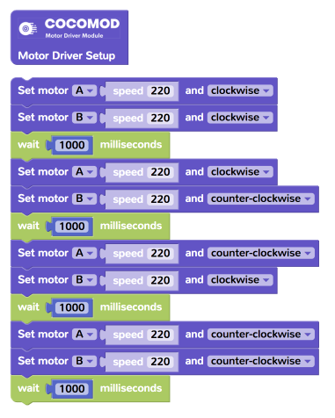

# 動力小車

---

## 課程簡介

《動力小車》課程是 CocoRobo 的 STEAM 課程體系中的基礎課程之一，在課程中，學生將以小車作爲學習和探究的對象，學習使用電子模組，編寫控制程序，使用 3D 打印等快速製造技術，從零開始設計和搭建一臺小車，并且在課程最後的比賽中一展身手

## 課程大綱

<table>
   <tr>
      <td><strong>序號</td>
      <td><strong>單元</td>
      <td><strong>課程内容</td>
   </tr>
   <tr>
      <td>1</td>
      <td rowspan=3>基礎學習</td>
      <td>引入：汽車的世界，認識小車</td>
   </tr>
   <tr>
      <td>2</td>
      <td>認識電子模組和編程平臺（一）</td>
   </tr>
   <tr>
      <td>3</td>
      <td>認識電子模組和編程平臺（二）</td>
   </tr>
   <tr>
      <td>4</td>
      <td rowspan=3>小車的動力-馬達驅動</td>
      <td>什麽是馬達，馬達驅動板 </td>
   </tr>
   <tr>
      <td>5</td>
      <td>程式驅動馬達，控制2個馬達</td>
   </tr>
   <tr>
      <td>6</td>
      <td>小項目：馬達的正反轉，調速</td>
   </tr>
   <tr>
      <td>7</td>
      <td rowspan=3>小車的結構-紙盒小車</td>
      <td>小車的結構</td>
   </tr>
   <tr>
      <td>8</td>
      <td>小項目：製作紙盒小車（一）</td>
   </tr>
   <tr>
      <td>9</td>
      <td>小項目：製作紙盒小車（二）</td>
   </tr>
   <tr>
      <td>10</td>
      <td rowspan=3>小車的控制-超聲波避障</td>
      <td>超聲波感應器測距 防追尾小車/倒車雷達</td>
   </tr>
   <tr>
      <td>11</td>
      <td>小項目：製作避障小車（一）</td>
   </tr>
   <tr>
      <td>12</td>
      <td>小項目：製作避障小車（二）</td>
   </tr>
   <tr>
      <td>13</td>
      <td rowspan=4>小車的結構-快速製造技術</td>
      <td>快速製造技術：3D 建模和 3D 打印</td>
   </tr>
   <tr>
      <td>14</td>
      <td>快速製造技術：2D建模和激光切割 </td>
   </tr>
   <tr>
      <td>15</td>
      <td>小項目：快速製造技術製作小車（一）</td>
   </tr>
   <tr>
      <td>16</td>
      <td>小項目：快速製造技術製作小車（二）</td>
   </tr>
   <tr>
      <td>17</td>
      <td rowspan=4>小車比賽</td>
      <td>小車比賽規則</td>
   </tr>
   <tr>
      <td>18</td>
      <td>製作比賽小車（一）</td>
   </tr>
   <tr>
      <td>19</td>
      <td>製作比賽小車（二）</td>
   </tr>
   <tr>
      <td>20</td>
      <td>舉行比賽</td>
   </tr>
   <tr>
      <td>選修模塊</td>
      <td>小車的控制-循跡小車</td>
      <td>1) 用紅外綫傳感器製作循跡小車 2)	循跡小車比賽</td>
   </tr>
   <tr>
      <td>選修模塊</td>
      <td>碰碰車-相撲小車的結構</td>
      <td>1)	製作碰撞小車 2)	碰撞小車比賽</td>
   </tr>
   <tr>
      <td>選修模塊</td>
      <td>藍牙遙控小車</td>
      <td>製作藍牙遙控小車</td>
   </tr>
   <tr>
      <td>選修模塊</td>
      <td>掃地機器人</td>
      <td>製作掃地功能小車</td>
   </tr>
</table>

## 模組介紹

本課程套件所涉及的模組請見下表：

|No. |模組 | 圖片 |簡介 | 詳細介紹 |
|-  |-  |-  |- |- |
|1. | 主機板模組  |  | 如果將電子模組類比爲人的身體，主機板模組就是電子模組的「大腦」(brain)， 我們在CocoBlockly中撰寫的程式則是主機板模組「大腦」思考要做什麼動作或 發出什麼指令時產生的各種「想法」；當「想法」傳輸至「大腦」後，主機板 模組從而控制其他模組並令其做出相應的動作或指令。 | [此頁面](/cocomod/main-controller) |
|2. | 教學模組  |  | 教學模組是 CocoMod 中一套輸入/輸出模組，利於學生使用該模組學習電子和 Arduino 的基礎知識。 | [此頁面](/cocomod/sensor-101) |
|3. | 馬達驅動模組  |  | 馬達驅動模組能夠同時控制兩個馬達，另外設定了四個外接感應器接口，可供使用者接入第三方感應器。 | [此頁面](/cocomod/motor-driver) |
|4. | 轉接模組A1/A2  |  | 轉接模組上嵌有多組接口，用於多種外接設備如伺服馬達，馬達的轉接，還可以外接第三方感應器，如紅外線感應器和超聲波感應器等等。每組接口由地線（GND），電源輸出（VCC），訊號接口（Digital / Analog）組成。 | [此頁面](/cocomod/hub) |
|5. | 藍牙通訊模組  |  | 藍牙通訊模組是用於能與藍牙配對的設備，遠端控制輸出。藍牙配對前狀態燈會以較快的頻率閃爍，當成功連接後狀態燈以較慢頻率閃爍。 | [此頁面](/cocomod/bluetooth) |

## 迷你小車的組裝

### 準備材料

電子模組：
- 主機板模組
- 馬達驅動模組

3D打印材料：
- 小車車身
- 小車車蓋
- 超聲波距離感應器固定架
- 紅外感應器固定架
- 車輪 x 2
- 萬向輪
- 萬向輪固定架

零件&工具：
- 馬達 x 2
- 輪胎 x 2
- 螺絲 x 4
- 螺母 x 4（optional）
- 螺絲刀

### 組裝迷你小車

#### 步驟一：組裝萬向輪

1. 將萬向輪放入小車車身的圓孔中，然後再安上萬向輪固定架;將小車輪胎套到小車車輪上。

#### 步驟二：組裝馬達
1. 將兩個馬達按照右圖的方式放置在小車車身的兩側。

2. 用螺絲穿過車身側邊的小孔和馬達的小孔，固定住一側的馬達的位置。

3. 如果螺絲不能很好地固定馬達，可以用螺母鎖住螺絲，使馬達更加穩固。

4. 用相同的方式固定住另外一側的馬達，就完成了馬達的組裝。

#### 步驟三：組裝車輪

1. 將車輪安裝在兩側的馬達上。

#### 步驟四： 裝配電子模組

1. 將馬達驅動模組拼接在主機板模組上面（如圖1）。

2. 將馬達的杜邦線接在馬達驅動模組的A和B位置上的引針（見圖2）。

3. 將電子模組放置在車身上（見圖3）。

#### 步驟五：完成組裝

1. 將車蓋合上就完成小車的組裝啦！

2. 可以在車頭或者車尾的位置添加超聲波距離感應器固定架或紅外感應器固定架，支持超身波避障小車和紅外線感應小車。

### 小車方向控制編程

前往 CocoBlockly，使用「馬達」一欄的積木，拖入右側的積木設計區來完成「向前、左轉、右轉、向後」的動作，上傳至主機板模組後即可實現讓迷你小車移動的效果

###### 若您有其他疑問，請電郵至 support-hk@cocorobo.cc 詢問

***

更新日期：2019年8月
