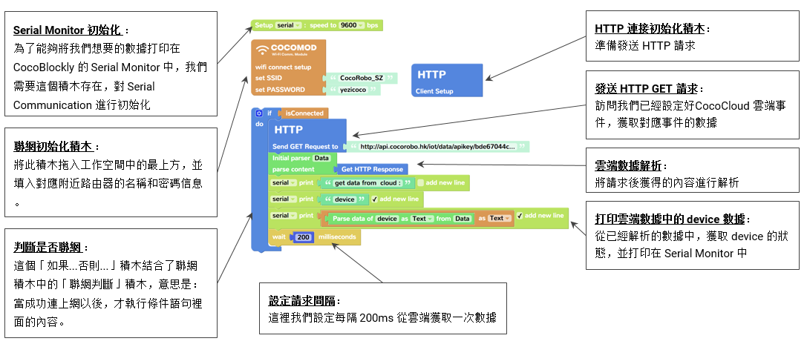

# 智能家居

---

## 课程简介

《智能家居》课程是 CocoRobo 的 STEAM 课程体系中的进阶课程之一，在本课程中，学生将深入探究家居环境中的智能家居产品，通过学习智能产品的系统设计方法，借助电子模块和程序，设计出智能家居产品来解决真实家居环境中的问题

「智能家居套件」内含有各种类的电子模块和第三方传感器。配合课程，学生通过使用该套件能够发挥创意，进行无限创作，例如制作一个环境监测装置，又或是组装一个智能的安防装置……丰富的制作材料能够更好地激发学生创作能力。其中，学生通过使用 WiFi 通信模块，能够感受物联网中数据传输的神奇魅力，体验到科技创新正在逐渐改变我们的生活方式，如以下几种形式：

1. [结合IFTTT](https://vimeo.com/250423195)：按钮触发后，发送提醒事项至 iOS 设备

2. [结合 MIT AI2](https://vimeo.com/250422799)：通过 MIT AI2 设计出来的手机 App，远距控制灯光和电机的响应

3. [迷你气象监测站](https://vimeo.com/229513379)：将周边的温湿度、光照、声音情况，呈现在屏幕上

## 课程大纲

<table>
   <tr>
      <td><strong>序号</td>
      <td><strong>单元</td>
      <td><strong>课程内容</td>
   </tr>
   <tr>
      <td>1</td>
      <td rowspan=3>基础学习</td>
      <td>引入：神奇的智能家居</td>
   </tr>
   <tr>
      <td>2</td>
      <td>认识电子模块和编程平台（一）</td>
   </tr>
   <tr>
      <td>3</td>
      <td>认识电子模块和编程平台（二）</td>
   </tr>
   <tr>
      <td>4</td>
      <td rowspan=4>家居传感器</td>
      <td>传感器，环境传感模块 </td>
   </tr>
   <tr>
      <td>5</td>
      <td>家居环境：温度湿度光照</td>
   </tr>
   <tr>
      <td>6</td>
      <td>家居警报：烟雾火焰</td>
   </tr>
   <tr>
      <td>7</td>
      <td>天气预报：雨滴风速</td>
   </tr>
   <tr>
      <td>8</td>
      <td rowspan=3>蓝牙通信</td>
      <td>蓝牙通信，蓝牙通信模块</td>
   </tr>
   <tr>
      <td>9</td>
      <td>手机 App/App Inventor</td>
   </tr>
   <tr>
      <td>10</td>
      <td>家居蓝牙通信</td>
   </tr>
   <tr>
      <td>11</td>
      <td rowspan=3>家居物联网</td>
      <td>WiFi 通信，WiFi 通信模块</td>
   </tr>
   <tr>
      <td>12</td>
      <td>云平台，IFTTT</td>
   </tr>
   <tr>
      <td>13</td>
      <td>家居环境监测报警</td>
   </tr>
   <tr>
      <td>14</td>
      <td rowspan=3>家居人工智能</td>
      <td>AI，语音识别/情绪识别</td>
   </tr>
   <tr>
      <td>15</td>
      <td>AI 云平台</td>
   </tr>
   <tr>
      <td>16</td>
      <td>小项目：语音控制/情绪识别灯</td>
   </tr>
   <tr>
      <td>17</td>
      <td rowspan=3>智能家居产品设计</td>
      <td>探究家居环境问题</td>
   </tr>
   <tr>
      <td>18</td>
      <td>设计思维</td>
   </tr>
   <tr>
      <td>19</td>
      <td>智能家居产品设计和制作</td>
   </tr>
   <tr>
      <td>20</td>
      <td>作品展示评比</td>
      <td>作品展示和评比</td>
   </tr>
   <tr>
      <td>选修模块</td>
      <td>帮助老人的智能家居</td>
      <td>为长者设计智能家居助手</td>
   </tr>
   <tr>
      <td>选修模块</td>
      <td>智能家居安全监控</td>
      <td>设计智能家居安全监控装置</td>
   </tr>
</table>

## 关于电子模块

本课程套件所涉及的模块请见下表：

|No. |模块 | 图片 |简介 | 详细介绍 |
|-  |-  |-  |- |- |
|1. | 主控模块  |  | 如果将电子模块模拟为人的身体，主控模块就是电子模块的「大脑」(brain)， 我们在CocoBlockly中撰写的程序则是主控模块「大脑」思考要做什么动作或 发出什么指令时产生的各种「想法」；当「想法」传输至「大脑」后，主控 模块从而控制其他模块并令其做出相应的动作或指令。 | [此页面](/cocomod/main-controller) |
|2. | WiFi 通信模块  |  | Wi-Fi 通信模块负责进行数据的无线传输，支持 HTTP/WebSocket/MQTT 通信协议，有了它，结合 CocoBlockly 的 WiFi 模式，用户可以非常直观地搭建属于自己的智能家居小应用。 | [此页面](/cocomod/wifi) |
|3. | 环境传感模块  |  | 环境传感模块既能够获取包括温度、湿度、声音的强弱程度、光线的强弱程度等环境数据，也可以根据环境数据变化作出反应。 | [此页面](/cocomod/environment) |
|4. | 屏幕模块  |  | 模块上连有一个 OLED 屏幕，接通之后可以绘制不同颜色的不同图案，屏幕面积（长 x 宽）为 128 x 128 px (像素)。 | [此页面](/cocomod/screen) |
|5. | 转接模块A1/A2  |  | 转接模块上嵌有多组接口，用于多种外接设备如伺服电机，电机的转接，还可以外接第三方传感器，如红外线传感器和超声波传感器等等。每组接口由地线（GND），电源输出（VCC），信号接口（Digital / Analog）组成。 | [此页面](/cocomod/hub) |
|6. | 正反转接模块  |  | 正反转接模块两边均为接出型插口，用于将模块按照相反接入。 | [此页面](/cocomod/reversed-adapter) |

更多关于 CocoMod 的资料请前往 [此页面](http://cocorobo.cn/product/cocomod) 查看

CocoMod 可以让你的作品能够拥有传感、控制真实世界的能力，只要接上各种输入/输出模块或元件， 例如 LED 灯、喇叭、电机、开关、温湿度传感器、声音传感器、红外线、显示装置，或是接上 WiFi 通信模块，就可以做出各式各样的应用产品或作品。

例如，利用温度传感器控制冷气、用声音控制灯光开关、利用伺服电机控制机械手臂、机器人，控制车、以及这些年很红的四旋翼飞行器等等。

下图是部分用 CocoMod 电子模块制作的创意原型：电子琴、双足机械人、迷你气象站、穿戴式 LED 手表

用户利用这些模块，结合 3D 打印和编程可以轻松地完成各类项目，其扩展性较市面上其他多数 Arduino 套件更适合入门者学习电子及编程知识。同时，我们鼓励用户通过结合线上及线下的课程，来更好、更快 的学习使用 CocoMod 电子模块

## 关于第三方传感器
为了让用户在使用智能家居套件时有更多样的创作可能性，我们提供了数 10 种第三方传感器，让用户有更多创作选择

本套件使用说明将主要针对
智能家居套件中所含的传感器：

<table>
<tr><th colspan="2">第三方传感器（套件中各 1 个）</th></tr>
<tr><td>1. 土壤湿度传感器 </td><td>7. 超声波距离传感器</td></tr>
<tr><td>2. 雨滴传感器 </td><td>8. 火焰传感器</td></tr>
<tr><td>3. 时钟模块 </td><td>9. 震动传感器</td></tr>
<tr><td>4. 烟雾传感器 </td><td>10. 红外避障传感器</td></tr>
<tr><td>5. 激光头模块 (注：本套件中已不再含有此模块)</td><td>11. 倾斜传感器</td></tr>
<tr><td>6. 人体红外传感器 </td><td>12. 光照传感器</td></tr>
</table>

## 关于 Coco Cloud 云平台

Coco Cloud 是由 CocoRobo 研发的物联网云端平台，用户可以将自己从 IoT 设备采集的数据上传至云端，随时查看最新的状态及历史状态，或者由 Cloud 向 IoT 设备发起控制，这些操作都可以通过我们的云端平台进行操作。

同时 Coco Cloud 支援与 IFTTT 连接，与超过 500 个在线应用结合，创作的可能更加丰富。另支持 Thingspeak，学生可以将数据传送至对应的 Thingspeak 监测面板中，进行科学学科的研究分析。

　

Coco Cloud 云端分为两部分：

|编号 |组件名称 | 组件描述  |
|-  |-  |-  |
|1. |事件  | 事件管理 |
|2. |仪表板  | 数据可视化面板，控制按钮面板 |

Coco Cloud 的特性：

* 支援 HTTP 协议,支援数据传送和指令控制
* 支援数据可视化,用户客制化监测界面
* 支援云端账户配置,随时随地管理 IoT 项目设备
* 支援 IFTTT、Thingspeak、Blynk 等外接 Web Service

更多关于 Coco Cloud 的介绍请前往 [此页面](../cocomod/coco-cloud) 查看

## 使用模块/传感器

### 使用环境传感模块

环境传感模块包含多个传感器，可以用来侦测环境相关资料，比如温度、湿度、光照强度
和声音强度等等。

环境传感模块，含有如下传感器组件：
   * 光照传感元件，对应接口为 A1
   * 声音传感元件，对应接口为 A2
   * 温度/湿度传感元件，对应接口为 A4
   * 蜂鸣器元件，对应接口为 D7
   * RGB灯光元件，对应接口分别为 D9, D10, D11，在 CocoBlockly 中，关于环境传感模块的程序积木在中，共有8个程序积木，具体如下：
1. 使用环境传感模块之前，都需要使用该积木进行初始化设置

2. 该积木能够读取周围声音的数值，数值范围为0~1023
　
3. 该积木能够读取周围光照强度的数值，数值范围为0~1023
　
4. 该积木能够读取周围温度的数值，温度数值范围是0-50 °C（误差± 2 °C）
　
5. 该积木能够读取周围环境湿度的数值，湿度数值范围是20-90% （误差± 5%）
　
6. 该积木能够设定环境传感模块中灯光的RGB数值
　
7. 该积木能够设定环境传感模块中蜂鸣器的音调频率
　
8. 该积木能够关闭环境传感模块中的蜂鸣器
　

#### 环境传感模块使用参考

**读取并显示环境参数**：使用环境传感模块，拼合OLED屏幕模块，将读取的环境参数，例如温度、湿度、亮度等显示在OLED萤幕上。

**知识储备**：OLED屏幕模块能够显示各种图案和字符，关于OLED屏幕模块的程序积木在中，共有 9 个积木，具体如下：

#### Blockly程序
该项目中Blockly程序主要分为四个部分：

一、程序初始化；

二、OLED屏幕显示字符”Sound”、”light”、”humidity”、”temperature”；

三、环境传感模块读取环境参数 ；  

四、OLED屏幕显示读取的参数。  

Blockly程序过长，下面以”显示声音参数“为例讲解：

#### 演示效果

前往下面网址，点击“环境参数显示”，查看完整程序
http://cocorobo.cn/cocoblockly/
### 使用第三方传感器
#### 使用土壤湿度传感器
土壤湿度传感器用于检测土壤的水分，将土壤传感器插入土壤中，土壤越干燥，输出电压越小，越湿润输出电压越大。

下面是土壤湿度传感器的组成部分：

　

*使用示例
1.  组装好电子模块部分：主控模块、转接模块
2.  拿出 USB 线连接计算机和主控模块；
3.  将「土壤湿度传感器」的接口按照下图连接至「转接模块」上

*程序示例

这段程序将会读取传感器传感到的模拟数值，并将数据打印在 Serial Monitor 中。数值将会在 0~1023 间变化。
#### 使用雨滴传感器
可用于不同天气状况的监测，并转换成数字信号或模拟信号；使用时，传感板上没有水滴时，数字输出为高电平，开关指示灯灭，滴上一滴水，数字输出为低电平，开关指示灯亮。下面是雨滴传感器的组成部分：

*使用示例
1.  组装好电子模块部分：主控模块、转接模块
2.  拿出 USB 线连接计算机和主控模块；
3.  将「雨滴传感器」的接口按照下图连接至「转接模块」上

*程序示例

这段程序将会读取传感器传感到的模拟数值，并将数据打印在 Serial Monitor 中。数值将会在 0~1023 间变化。
#### 使用时钟模块
to be edited
#### 使用烟雾传感器
当传感器所处环境中存在可燃性气体时，传感器的电导率随空气中可燃气体浓度的增加而增大，模拟信号对应的输出电压随浓度越高电压越高

支持：数字信号、模拟信号输入

　

*使用示例
1.  组装好电子模块部分：主控模块、转接模块
2.  拿出 USB 线连接计算机和主控模块；
3.  将「烟雾传感器」的接口按照下图连接至「转接模块」上

*程序示例

这段程序将会读取传感器传感到的模拟数值，并将数据打印在 Serial Monitor 中。数值将会在 0~1023 间变化。
#### 使用激光头模块
用于发射低功率的激光光束

支持：数字信号输出

*使用示例
1.  组装好电子模块部分：主控模块、转接模块
2.  拿出 USB 线连接计算机和主控模块；
3.  将「激光头模块」的接口按照下图连接至「转接模块」上

*程序示例

这段程序将会让激光头模块每隔 1 秒发出激光光束。
#### 使用人体红外传感器
当有人进入其传感范围则输出高电平，人离开传感范围则自动延时关闭高电平，否则输出低电平

支持：数字信号输入

　

*使用示例
1.  组装好电子模块部分：主控模块、转接模块
2.  拿出 USB 线连接计算机和主控模块；
3.  将「人体红外传感器」的接口按照下图连接至「转接模块」上

*程序示例

这段程序将会读取传感器传感到的数字数值，并将数据打印在 Serial Monitor 中。数值将会以 0 和 1呈现，代表附近有人或无人。

#### 使用超声波距离传感器
该传感器利用超声波测距离，多应用于机器人避开障碍物或其他距离测量的项目。传感距离的单位为 CM（厘米）

　

*使用示例
1.  组装好电子模块部分：主控模块、转接模块
2.  拿出 USB 线连接计算机和主控模块；
3.  将「超声波距离传感器」的接口按照下图连接至「转接模块」上

*程序示例

这段程序将会读取传感器传感到的距离数值（CM），并将数据打印在 Serial Monitor 中，同时用户可以设置最远的传感距离数值
#### 使用火焰传感器
用于各种震动触发作用，不震动时，震动开关呈闭合导通状态，输出端输出低电平，绿色指示灯亮；

支持：数字信号输入

*使用示例
1.  组装好电子模块部分：主控模块、转接模块
2.  拿出 USB 线连接计算机和主控模块；
3.  将「火焰传感器」的接口按照下图连接至「转接模块」上

*程序示例

这段程序将会读取传感器传感到的模拟数值，并将数据打印在 Serial Monitor 中。数值将会在 0~1023 间变化。

#### 使用震动传感器
用于各种震动触发作用，不震动时，震动开关呈闭合导通状态，输出端输出低电平，绿色指示灯亮；

支持：数字信号输入

*使用示例
1.  组装好电子模块部分：主控模块、转接模块
2.  拿出 USB 线连接计算机和主控模块；
3.  将「震动传感器」的接口按照下图连接至「转接模块」上

*程序示例

这段程序将会读取传感器传感到的模拟数值，并将数据打印在 Serial Monitor 中。数值将会以 0 和 1呈现，代表传感器附属的物体是否有震动。

#### 使用红外避障传感器
当传感器发射管与接收管检测到前方障碍物信号时，绿色指示灯将被点亮，同时数字端口持续输出低电平信号

支持：数字信号输入

　

*使用示例
1.  组装好电子模块部分：主控模块、转接模块
2.  拿出 USB 线连接计算机和主控模块；
3.  将「红外避障传感器」的接口按照下图连接至「转接模块」上

*程序示例

这段程序将会读取传感器传感到的模拟数值，并将数据打印在 Serial Monitor 中。数值将会以 0 和 1呈现，代表传感器检测的距离内是否有障碍。
#### 使用倾斜传感器
传感器可感知物体角度的变化，将传感器平轻放桌面上，将模块朝一个方向慢慢旋转，开关指示灯会点亮，然后再将模块朝相反的方向旋转，回到最初的状态，开关指示灯会灭

支持：数字信号输入

*使用示例
1.  组装好电子模块部分：主控模块、转接模块
2.  拿出 USB 线连接计算机和主控模块；
3.  将「倾斜传感器」的接口按照下图连接至「转接模块」上

*程序示例

这段程序将会读取传感器传感到的模拟数值，并将数据打印在 Serial Monitor 中。数值将会在 0~1023 间变化。

#### 使用光照传感器
土壤湿度传感器用于检测土壤的水分，将土壤传感器插入土壤中，土壤越干燥，输出电压越小，越湿润输出电压越大。
下面是土壤湿度传感器的组成部分：

　

*使用示例
1.  组装好电子模块部分：主控模块、转接模块
2.  拿出 USB 线连接计算机和主控模块；
3.  将「光照传感器」的接口按照下图连接至「转接模块」上

*程序示例

这段程序将会读取传感器传感到的模拟数值，并将数据打印在 Serial Monitor 中。数值将会在 0~1023 间变化。
### 了解数组
在计算机科学中，数组是由相同类型的元素的集合，所组成的资料。
在 CocoBlockly 中，我们使用数组来存储一系列数据（适用于传输大于 1 个数据的情况）。

像上面的情况：
第一个积木为创建数组所需要的积木，其中有 3 个数据；
第二个积木为获取数组中位置为第 0 位的数据

**注：在计算机中，位置顺序由 0 开始数起。**

本示例将向用户展示如何将数组中的数据，打印在 Serial Monitor 中

### 数据收集
本示例将向用户展示如何收集环境传感模块的数据，并将数据打印在 Serial Monitor 中

## 使用蓝牙模块
### 关于蓝牙模块
**注：蓝牙模块不含在智能家居套件中，如欲使用，请联系销售购买或者获取样品**

CocoRobo 的蓝牙模块为一款通信类模块，使用蓝牙 2.0 为通信协议，能够接收来自 Android 手机 app 通过蓝牙传输进入的数据。

使用蓝牙模块时，请结合主控模块一起使用。

  
### 使用蓝牙接收指令
#### 蓝牙控制LED 灯
本项目结合以下模块／配件一起使用：LED 模块、主控模块

项目描述：本项目将结合特定 Android app 进行，使用 app 中的滑动条，将会控制 LED 模块上的亮度（蓝色灯光）。

蓝牙设定指引：
请扫描上方的二维码下载 apk 安装文件，并安装。安装后，请前往系统设定中的蓝牙设备管理中，添加新设备，在确保蓝牙模块和主控模块组合，以及 USB 通电的情况下，搜索名为 HC-05 的设备，并配对。连接成功后，打开名为 Coco BT Slider 的 app，点击界面中的黄色按钮选择前面已经配对好的设备，进行连接。

##### 程序示例

#### 蓝牙控制电机
**注：电机驱动模块不含在智能家居套件中，如欲使用，请联系销售购买或者获取样品**

本项目结合以下模块／配件一起使用：电机驱动模块、主控模块、2 个 TT 电机

项目描述：本项目将结合特定 Android app 进行，使用 app 中的4个按钮，来控制两个电机的转动方向。

蓝牙设定指引：
请扫描上方的二维码下载 apk 安装文件，并安装。安装后，请前往系统设定中的蓝牙设备管理中，添加新设备，在确保蓝牙模块和主控模块组合，以及 USB 通电的情况下，搜索名为 HC-05 的设备，并配对。连接成功后，打开名为 Coco Robot Car  的 app，点击界面中的黄色按钮选择前面已经配对好的设备，进行连接。

##### 程序示例

#### 蓝牙控制伺服电机
**注：伺服电机转接驱动模块不含在智能家居套件中，如欲使用，请联系销售购买或者获取样品**

本项目结合以下模块／配件一起使用：伺服电机转接模块、主控模块、1 个9g 伺服电机

项目描述：
本项目将结合特定 Android app 进行，使用 app 中的滑动条，控制伺服电机转接模块上的所有 6 个接口的角度

蓝牙设定指引：
请扫描上方的二维码下载 apk 安装文件，并安装。安装后，请前往系统设定中的蓝牙设备管理中，添加新设备，在确保蓝牙模块和主控模块组合，以及 USB 通电的情况下，搜索名为 HC-05 的设备，并配对。连接成功后，打开名为 Coco Servo Controller  的 app，点击界面中的黄色按钮选择前面已经配对好的设备，进行连接。

##### 程序示例

## 使用 WiFi 模块
- [关于 Wi-Fi 模块](/cocomod/wifi)
#### 示范案例
下面我们将使用环境传感模块、主控模块和WiFi通信模块 实现远距离监测环境的实时变化。

实现的效果：【CocoCloud显示环境传感模块读取的实时数据】

　

制作的步骤：
* STEP 1 — 注册Cocorobo账号

　　为了更好地使用CocoBlockly编写程序，先注册一个CocoRobo账号，成功注册账号后，可使用CocoRobo的云端储存功能和CocoCloud的数据可视化功能。CocoRobo账号可以前往Cocorobo官方网站主页注册，登录后，CocoCloud网站将同步登录你的账号。

* STEP 2 — 编写主控模块的程序：使环境传感模块读取环境的数据，并且将数据发送WiFi通信模块

请前往CocoBlockly平台 http://cocorobo.cn/cocoblockly/dev  的主控模式进行程序编写，然后将程序单独上传至主控模块。

 　
* STEP 3 — 前往CocoCloud，新建Event，获取URL地址

* STEP 4 — 编写WiFi通信模块的程序：使WiFi通信模块接收数据，连接网络，并且将数据发送至CocoCloud云平台

* STEP 5 — 拼合环境传感模块、主控模块和WiFi通信模块，接通电源，观察数据的变化

#### 参考示例
为了方便新用户了解如何使用这些积木，我们提供了一些范例供参考：

示例1：显示网络设备信息这个示例将会在 Serial Monitor 中打印 3 个设备数据，包括本机 IP 地址。

示例2：接收来自 主控模块 发送的简单数据这个示例将会告诉你如何接收从主控模块传输的数据，并储存在数组中

示例3：接收来自 主控模块 发送的环境传感数据这个示例将会告诉你如何接收从主控模块传输的数据，包括温度、湿度、光照强度和声音强度，并储存在数组中

示例4：接入 IFTTT 的 Webhook这个示例将会以接入 IFTTT 为示例，告诉你如何发起 HTTP GET 请求，并获得请求得到的答复内容，打印在 Serial Monitor 中

示例5：发送数据至 CocoCloud  这个示例将会演示把数据发送至 CocoCloud 云端平台中用户自己创建的 Event 中

示例6：接入 IFTTT（简单积木版本）  这个示例将会用一个简单的积木，让用户能够仅输入 IFTTT 的 API Key、 Webhool URL 和对应的 3 个数据，就能接入 Webhook

示例7：接入 Thingspeak 这个示例将会用一个简单的积木，让用户能够仅输入 Thingspeak 所需要的信息就能够接入

示例8：从 CocoCloud 云端平台获取数据这个示例将会演示如何向云端是将获取自己创建的事件的数据
### 使用网路连接积木
网路连接积木：

涵盖了使设备连接至路由器的功能，同时还能获取设备的 IP、MAC 地址以及网关 IP 地址

积木描述：

#### 示例

### 使用主控/Wi-Fi数据通信积木
数据传输积木：主控模式（Main Mode）和 WiFi 模式（WiFi Mode）下都有该类型积木，用于两个模块之间的数据传输，可接收也可以发送。
#### 主控模式的数据传输积木

#### WiFi模块的数据传输积木

#### 示例
* 主控模式发送数据

* WiFi模式接收数据

### 使用客户端积木
客户端积木：

此类积木主要用于：让 WiFi 设备向其他设备或者云平台发送请求，目前支持 HTTP 的 GET/POST/PUT 请求方式

#### 示例

### 使用云端数据积木
云端数据积木：

此类积木主要用于 CocoCloud 云端数据的接收（解析）和发送，数据内容格式为 JSON。

积木描述：

#### 示例
* 生成云端数据

* 获取云端数据

## 结合第三方服务
### 使用 Web 服务积木
Web 服务积木：

此类积木主要用于：针对 IFTTT 或 Thingspeak 进行数据传输／更新
#### 主控模式的数据传输积木

### 接入 IFTTT 应用
#### 什么是 IFTTT？

　　IFTTT 是 If This Then That 的缩写，它是一个新生的网络服务平台。通俗的来讲，IFTTT 的作用就是如果触发了一件事，则执行设定好的另一件事。所谓的「事」，指的是各种应用、服务之间可以进行有趣的连锁反应。它就像是一座神奇的桥梁，能连接我们日常所用的各种网络服务。

　　本章节中，我们向大家介绍如何使用 CocoMod 电子模块和 CocoBlockly 制作一个能够接入 IFTTT 应用的项目：1) 通过 Google Assistant 控制蜂鸣器的开与关；2) 通过电子模块收据的环境数据，分时段将数据记录在 Google Sheets 上。

　　举个例子，以下这个 Applet 中：

意味著：若离开或回到家时，则提醒开启/关闭  WiFi：在 iOS 装置上，并没有任何第三方程序有权限直接关闭/开启 WiFi ，但通过 IFTTT 却可以发出提醒通知。这个设置可以在你离开家或是回到家时，发出推播通知，提醒你开启/关闭 WiFi ，以节省电力。
#### IFTTT 注册流程介绍
- 网页版本：

1.在箭头处填写注册邮箱

 

2.设置密码后点击\[ sign up \] 按钮完成注册

 

- 手机版本：依次填写注册名、邮箱以及账户密码，之后登录该服务可以选择注册名或者邮箱任一

#### CocoMod + IFTTT

本章节中，我们向大家介绍如何使用 CocoMod 电子模块和 CocoBlockly 制作 1 个接入 IFTTT 应用的项目：

* 通过电子模块收据的环境数据，分时段将数据记录在 Google Sheets。
#### 示例：积木的编写

### 接入 Thingspeak
#### 什么是 ThingSpeak？

　　ThingSpeak 是由 MathWorks 开发的一款云端资料整合器的平台，只需要通过简单 RESTful API 请求，用户使用自己的 IoT 设备可以向 Thinkspeak 进行数据传输，同时 Thingspeak 提供足够强大的数据分析和处理能力，比如在线编辑／调校数据，或者结合 MATLAB 进行数据可视化，是目前比较流行的在线数据分析／可视化工具之一。

　　本章节中，我们向大家介绍如何使用 CocoMod 电子模块和 CocoBlockly 制作一个能够向 Thingspeak 传送数据的 IoT 项目

更多关于 Thingspeak 的介绍请前往：https://www.mathworks.com/videos/introduction-to-thingspeak-107749.html
#### Thingspeak 注册流程介绍
1.进入thingspeak页面后在左边方框内容处填写信息

2.填写完整信息后在下方点击\[ continue \]按钮后出现认证界面，去往填写邮箱按照步骤认证完毕后，再次点击该界面下方的\[ continue \]按钮

3.注册完成
#### CocoMod + ThingSpeak

　　本章节中，我们向大家介绍如何使用 CocoMod 电子模块和 CocoBlockly 制作一个能够向 Thingspeak 传送环境数据（温湿度、光照强度、声音强度）的 IoT 项目。

#### 示例：积木的编写

