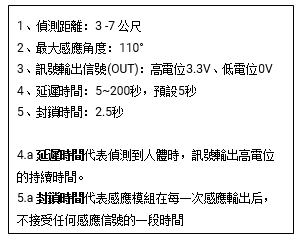
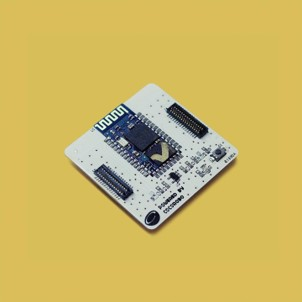

# 智慧家居

---

## 課程簡介

《智能家居》課程是 CocoRobo 的 STEAM 課程體系中的進階課程之一，在本課程中，學生將深入探究家居環境中的智能家居產品，通過學習智能產品的系統設計方法，藉助電子模組和程式，設計出智能家居產品來解決真實家居環境中的問題

「智慧家居套件」內含有各種類的電子模組和第三方感應器。配合課程，學生通過使用該套件能夠發揮創意，進行無限創作，例如製作一個環境監測裝置，又或是組裝一個智能的安防裝置……豐富的製作材料能夠更好地激發學生創作能力。其中，學生通過使用 WiFi 通訊模組，能夠感受物聯網中數據傳輸的神奇魅力，體驗到科技創新正在逐漸改變我們的生活方式，如以下幾種形式：

1. [結合IFTTT](https://vimeo.com/250423195)：按鈕觸發後，發送提醒事項至 iOS 設備

2. [結合 MIT AI2](https://vimeo.com/250422799)：通過 MIT AI2 設計出來的手機 App，遠距控制燈光和馬達的響應

3. [迷你氣象監測站](https://vimeo.com/229513379)：將周邊的溫溼度、光照、聲音情況，呈現在熒幕上

## 課程大綱

<table>
   <tr>
      <td><strong>序號</td>
      <td><strong>單元</td>
      <td><strong>課程内容</td>
   </tr>
   <tr>
      <td>1</td>
      <td rowspan=3>基礎學習</td>
      <td>引入：神奇的智能家居</td>
   </tr>
   <tr>
      <td>2</td>
      <td>認識電子模組和編程平臺（一）</td>
   </tr>
   <tr>
      <td>3</td>
      <td>認識電子模組和編程平臺（二）</td>
   </tr>
   <tr>
      <td>4</td>
      <td rowspan=4>家居感應器</td>
      <td>感應器，環境感應模組 </td>
   </tr>
   <tr>
      <td>5</td>
      <td>家居環境：溫度濕度光照</td>
   </tr>
   <tr>
      <td>6</td>
      <td>家居警報：烟霧火焰</td>
   </tr>
   <tr>
      <td>7</td>
      <td>天氣預報：雨滴風速</td>
   </tr>
   <tr>
      <td>8</td>
      <td rowspan=3>藍牙通訊</td>
      <td>藍牙通訊，藍牙通訊模組</td>
   </tr>
   <tr>
      <td>9</td>
      <td>手機 App/App Inventor</td>
   </tr>
   <tr>
      <td>10</td>
      <td>家居藍牙通訊</td>
   </tr>
   <tr>
      <td>11</td>
      <td rowspan=3>家居物聯網</td>
      <td>WiFi 通訊，WiFi 通訊模組</td>
   </tr>
   <tr>
      <td>12</td>
      <td>雲平臺，IFTTT</td>
   </tr>
   <tr>
      <td>13</td>
      <td>家居環境監測報警</td>
   </tr>
   <tr>
      <td>14</td>
      <td rowspan=3>家居人工智能</td>
      <td>AI，語音識別/情緒識別</td>
   </tr>
   <tr>
      <td>15</td>
      <td>AI 雲平臺</td>
   </tr>
   <tr>
      <td>16</td>
      <td>小項目：語音控制/情緒識別燈</td>
   </tr>
   <tr>
      <td>17</td>
      <td rowspan=3>智能家居產品設計</td>
      <td>探究家居環境問題</td>
   </tr>
   <tr>
      <td>18</td>
      <td>設計思維</td>
   </tr>
   <tr>
      <td>19</td>
      <td>智能家居產品設計和製作</td>
   </tr>
   <tr>
      <td>20</td>
      <td>作品展示評比</td>
      <td>作品展示和評比</td>
   </tr>
   <tr>
      <td>選修模塊</td>
      <td>幫助老人的智能家居</td>
      <td>為長者設計智能家居助手</td>
   </tr>
   <tr>
      <td>選修模塊</td>
      <td>智能家居安全監控</td>
      <td>設計智能家居安全監控裝置</td>
   </tr>
</table>

## 關於電子模組

本課程套件所涉及的模組請見下表：

|No. |模組 | 圖片 |簡介 | 詳細介紹 |
|-  |-  |-  |- |- |
|1. | 主機板模組  |  | 如果將電子模組類比爲人的身體，主機板模組就是電子模組的「大腦」(brain)， 我們在CocoBlockly中撰寫的程式則是主機板模組「大腦」思考要做什麼動作或 發出什麼指令時產生的各種「想法」；當「想法」傳輸至「大腦」後，主機板 模組從而控制其他模組並令其做出相應的動作或指令。 | [此頁面](/cocomod/main-controller) |
|2. | WiFi 通訊模組  |  | Wi-Fi 通訊模組負責進行數據的無線傳輸，支持 HTTP/WebSocket/MQTT 通訊協議，有了它，結合 CocoBlockly 的 WiFi 模式，用戶可以非常直觀地搭建屬於自己的智慧家居小應用。 | [此頁面](/cocomod/wifi) |
|3. | 環境感應模組  |  | 環境感應模組既能夠獲取包括溫度、濕度、聲音的強弱程度、光線的強弱程度等環境數據，也可以根據環境數據變化作出反應。 | [此頁面](/cocomod/environment) |
|4. | 熒幕模組  |  | 模組上連有一個 OLED 熒幕，接通之後可以繪製不同顏色的不同圖案，熒幕面積（長 x 寬）爲 128 x 128 px (像素)。 | [此頁面](/cocomod/screen) |
|5. | 轉接模組A1/A2  |  | 轉接模組上嵌有多組接口，用於多種外接設備如伺服馬達，馬達的轉接，還可以外接第三方感應器，如紅外線感應器和超聲波感應器等等。每組接口由地線（GND），電源輸出（VCC），訊號接口（Digital / Analog）組成。 | [此頁面](/cocomod/hub) |
|6. | 正反轉接模組  |  | 正反轉接模組兩邊均爲接出型插口，用於將模組按照相反接入。 | [此頁面](/cocomod/reversed-adapter) |

更多關於 CocoMod 的資料請前往 [此頁面](http://cocorobo.hk/product/cocomod) 查看

CocoMod 可以讓你的作品能夠擁有感應、控制真實世界的能力，只要接上各種輸入/輸出模組或元件， 例如 LED 燈、喇叭、馬達、開關、溫溼度感應器、聲音感應器、紅外線、顯示裝置，或是接上 WiFi 通訊模組，就可以做出各式各樣的應用產品或作品。

例如，利用溫度感應器控制冷氣、用聲音控制燈光開關、利用伺服馬達控制機械手臂、機器人，控制車、以及這些年很紅的四旋翼飛行器等等。

下圖是部分用 CocoMod 電子模組製作的創意原型：電子琴、雙足機械人、迷你氣象站、穿戴式 LED 手錶

用戶利用這些模組，結合 3D 打印和編程可以輕鬆地完成各類項目，其擴展性較市面上其他多數 Arduino 套件更適合入門者學習電子及編程知識。同時，我們鼓勵用戶通過結合線上及線下的課程，來更好、更快 的學習使用 CocoMod 電子模組

## 關於第三方感應器
爲了讓用戶在使用智慧家居套件時有更多樣的創作可能性，我們提供了數 10 種第三方感應器，讓用戶有更多創作選擇

本套件使用說明將主要針對
智慧家居套件中所含的感應器：

<table>
<tr><th colspan="2">第三方感應器（套件中各 1 個）</th></tr>
<tr><td>1. 土壤溼度感應器 </td><td>7. 超聲波距離感應器</td></tr>
<tr><td>2. 雨滴感應器 </td><td>8. 火焰感應器</td></tr>
<tr><td>3. 時鐘模組 </td><td>9. 震動感應器</td></tr>
<tr><td>4. 煙霧感應器 </td><td>10. 紅外避障感應器</td></tr>
<tr><td>5. 激光頭模組 (注：本套件中已不再含有此模組)</td><td>11. 傾斜感應器</td></tr>
<tr><td>6. 人體紅外感應器 </td><td>12. 光照感應器</td></tr>
</table>

## 關於 Coco Cloud 雲平臺

Coco Cloud 是由 CocoRobo 研發的物聯網雲端平臺，用戶可以將自己從 IoT 設備採集的數據上傳至雲端，隨時查看最新的狀態及歷史狀態，或者由 Cloud 向 IoT 設備發起控制，這些操作都可以通過我們的雲端平臺進行操作。

同時 Coco Cloud 支援與 IFTTT 連接，與超過 500 個在線應用結合，創作的可能更加豐富。另支持 Thingspeak，學生可以將數據傳送至對應的 Thingspeak 監測面板中，進行科學學科的研究分析。

　

Coco Cloud 雲端分爲兩部分：

|編號 |組件名稱 | 組件描述  |
|-  |-  |-  |
|1. |事件  | 事件管理 |
|2. |儀表板  | 數據可視化面板，控制按鈕面板 |

Coco Cloud 的特性：

* 支援 HTTP 協議,支援數據傳送和指令控制
* 支援數據可視化,用戶客制化監測界面
* 支援雲端賬戶配置,隨時隨地管理 IoT 項目設備
* 支援 IFTTT、Thingspeak、Blynk 等外接 Web Service

更多關於 Coco Cloud 的介紹請前往 [此頁面](../cocomod/coco-cloud) 查看

## 使用模組/感應器

### 使用環境感應模組

環境感應模組包含多個感應器，可以用來偵測環境相關資料，比如溫度、溼度、光照強度
和聲音強度等等。

環境感應模組，含有如下感應器組件：
   * 光照感應元件，對應接口爲 A1
   * 聲音感應元件，對應接口爲 A2
   * 溫度/溼度感應元件，對應接口爲 A4
   * 蜂鳴器元件，對應接口爲 D7
   * RGB燈光元件，對應接口分別爲 D9, D10, D11，在 CocoBlockly 中，關於環境感應模組的程式積木在中，共有8個程式積木，具體如下：
1. 使用環境感應模組之前，都需要使用該積木進行初始化設置

2. 該積木能夠讀取周圍聲音的數值，數值範圍爲0~1023
　
3. 該積木能夠讀取周圍光照強度的數值，數值範圍爲0~1023
　
4. 該積木能夠讀取周圍溫度的數值，溫度數值範圍是0-50 °C（誤差± 2 °C）
　
5. 該積木能夠讀取周圍環境溼度的數值，溼度數值範圍是20-90% （誤差± 5%）
　
6. 該積木能夠設定環境感應模組中燈光的RGB數值
　
7. 該積木能夠設定環境感應模組中蜂鳴器的音調頻率
　
8. 該積木能夠關閉環境感應模組中的蜂鳴器
　

#### 環境感應模組使用參考

**讀取並顯示環境參數**：使用環境感應模組，拼合OLED熒幕模組，將讀取的環境參數，例如溫度、溼度、亮度等顯示在OLED螢幕上。

**知識儲備**：OLED熒幕模組能夠顯示各種圖案和字符，關於OLED熒幕模組的程式積木在中，共有 9 個積木，具體如下：

#### Blockly程式
該項目中Blockly程式主要分爲四個部分：

一、程式初始化；

二、OLED熒幕顯示字符”Sound”、”light”、”humidity”、”temperature”；

三、環境感應模組讀取環境參數 ；  

四、OLED熒幕顯示讀取的參數。  

Blockly程式過長，下面以”顯示聲音參數“爲例講解：

#### 演示效果

前往下面網址，點擊“環境參數顯示”，查看完整程式
http://cocorobo.hk/cocoblockly/
### 使用第三方感應器
#### 使用土壤溼度感應器
土壤溼度感應器用於檢測土壤的水分，將土壤感應器插入土壤中，土壤越乾燥，輸出電壓越小，越溼潤輸出電壓越大。

下面是土壤溼度感應器的組成部分：

　

*使用示例
1.  組裝好電子模組部分：主機板模組、轉接模組
2.  拿出 USB 線連接計算機和主機板模組；
3.  將「土壤溼度感應器」的接口按照下圖連接至「轉接模組」上

*程式示例

這段程式將會讀取感應器感應到的類比數值，並將數據打印在 Serial Monitor 中。數值將會在 0~1023 間變化。
#### 使用雨滴感應器
可用於不同天氣狀況的監測，並轉換成數位訊號或類比訊號；使用時，感應板上沒有水滴時，數位輸出爲高電平，開關指示燈滅，滴上一滴水，數位輸出爲低電平，開關指示燈亮。下面是雨滴感應器的組成部分：

*使用示例
1.  組裝好電子模組部分：主機板模組、轉接模組
2.  拿出 USB 線連接計算機和主機板模組；
3.  將「雨滴感應器」的接口按照下圖連接至「轉接模組」上

*程式示例

這段程式將會讀取感應器感應到的類比數值，並將數據打印在 Serial Monitor 中。數值將會在 0~1023 間變化。
#### 使用時鐘模組
to be edited
#### 使用煙霧感應器
當感應器所處環境中存在可燃性氣體時，感應器的電導率隨空氣中可燃氣體濃度的增加而增大，類比訊號對應的輸出電壓隨濃度越高電壓越高

支持：數位訊號、類比訊號輸入

　

*使用示例
1.  組裝好電子模組部分：主機板模組、轉接模組
2.  拿出 USB 線連接計算機和主機板模組；
3.  將「煙霧感應器」的接口按照下圖連接至「轉接模組」上

*程式示例

這段程式將會讀取感應器感應到的類比數值，並將數據打印在 Serial Monitor 中。數值將會在 0~1023 間變化。
#### 使用激光頭模組
用於發射低功率的激光光束

支持：數位訊號輸出

*使用示例
1.  組裝好電子模組部分：主機板模組、轉接模組
2.  拿出 USB 線連接計算機和主機板模組；
3.  將「激光頭模組」的接口按照下圖連接至「轉接模組」上

*程式示例

這段程式將會讓激光頭模組每隔 1 秒發出激光光束。
#### 使用人體紅外感應器
當有人進入其感應範圍則輸出高電平，人離開感應範圍則自動延時關閉高電平，否則輸出低電平

支持：數位訊號輸入

　

*使用示例
1.  組裝好電子模組部分：主機板模組、轉接模組
2.  拿出 USB 線連接計算機和主機板模組；
3.  將「人體紅外感應器」的接口按照下圖連接至「轉接模組」上

*程式示例

這段程式將會讀取感應器感應到的數位數值，並將數據打印在 Serial Monitor 中。數值將會以 0 和 1呈現，代表附近有人或無人。

#### 使用超聲波距離感應器
該感應器利用超聲波測距離，多應用於機器人避開障礙物或其他距離測量的項目。感應距離的單位爲 CM（釐米）

　

*使用示例
1.  組裝好電子模組部分：主機板模組、轉接模組
2.  拿出 USB 線連接計算機和主機板模組；
3.  將「超聲波距離感應器」的接口按照下圖連接至「轉接模組」上

*程式示例

這段程式將會讀取感應器感應到的距離數值（CM），並將數據打印在 Serial Monitor 中，同時用戶可以設置最遠的感應距離數值
#### 使用火焰感應器
用於各種震動觸發作用，不震動時，震動開關呈閉合導通狀態，輸出端輸出低電平，綠色指示燈亮；

支持：數位訊號輸入

*使用示例
1.  組裝好電子模組部分：主機板模組、轉接模組
2.  拿出 USB 線連接計算機和主機板模組；
3.  將「火焰感應器」的接口按照下圖連接至「轉接模組」上

*程式示例

這段程式將會讀取感應器感應到的類比數值，並將數據打印在 Serial Monitor 中。數值將會在 0~1023 間變化。

#### 使用震動感應器
用於各種震動觸發作用，不震動時，震動開關呈閉合導通狀態，輸出端輸出低電平，綠色指示燈亮；

支持：數位訊號輸入

*使用示例
1.  組裝好電子模組部分：主機板模組、轉接模組
2.  拿出 USB 線連接計算機和主機板模組；
3.  將「震動感應器」的接口按照下圖連接至「轉接模組」上

*程式示例

這段程式將會讀取感應器感應到的類比數值，並將數據打印在 Serial Monitor 中。數值將會以 0 和 1呈現，代表感應器附屬的物體是否有震動。

#### 使用紅外避障感應器
當感應器發射管與接收管檢測到前方障礙物訊號時，綠色指示燈將被點亮，同時數位端口持續輸出低電平訊號

支持：數位訊號輸入

　

*使用示例
1.  組裝好電子模組部分：主機板模組、轉接模組
2.  拿出 USB 線連接計算機和主機板模組；
3.  將「紅外避障感應器」的接口按照下圖連接至「轉接模組」上

*程式示例

這段程式將會讀取感應器感應到的類比數值，並將數據打印在 Serial Monitor 中。數值將會以 0 和 1呈現，代表感應器檢測的距離內是否有障礙。
#### 使用傾斜感應器
感應器可感知物體角度的變化，將感應器平輕放桌面上，將模組朝一個方向慢慢旋轉，開關指示燈會點亮，然後再將模組朝相反的方向旋轉，回到最初的狀態，開關指示燈會滅

支持：數位訊號輸入

*使用示例
1.  組裝好電子模組部分：主機板模組、轉接模組
2.  拿出 USB 線連接計算機和主機板模組；
3.  將「傾斜感應器」的接口按照下圖連接至「轉接模組」上

*程式示例

這段程式將會讀取感應器感應到的類比數值，並將數據打印在 Serial Monitor 中。數值將會在 0~1023 間變化。

#### 使用光照感應器
土壤溼度感應器用於檢測土壤的水分，將土壤感應器插入土壤中，土壤越乾燥，輸出電壓越小，越溼潤輸出電壓越大。
下面是土壤溼度感應器的組成部分：

　

*使用示例
1.  組裝好電子模組部分：主機板模組、轉接模組
2.  拿出 USB 線連接計算機和主機板模組；
3.  將「光照感應器」的接口按照下圖連接至「轉接模組」上

*程式示例

這段程式將會讀取感應器感應到的類比數值，並將數據打印在 Serial Monitor 中。數值將會在 0~1023 間變化。
### 瞭解數組
在計算機科學中，數組是由相同類型的元素的集合，所組成的資料。
在 CocoBlockly 中，我們使用數組來存儲一系列數據（適用於傳輸大於 1 個數據的情況）。

像上面的情況：
第一個積木爲創建數組所需要的積木，其中有 3 個數據；
第二個積木爲獲取數組中位置爲第 0 位的數據

**注：在計算機中，位置順序由 0 開始數起。**

本示例將向用戶展示如何將數組中的數據，打印在 Serial Monitor 中

### 數據收集
本示例將向用戶展示如何收集環境感應模組的數據，並將數據打印在 Serial Monitor 中

## 使用藍牙模組
### 關於藍牙模組
**注：藍牙模組不含在智慧家居套件中，如欲使用，請聯繫銷售購買或者獲取樣品**

CocoRobo 的藍牙模組爲一款通訊類模組，使用藍牙 2.0 爲通訊協議，能夠接收來自 Android 手機 app 通過藍牙傳輸進入的數據。

使用藍牙模組時，請結合主機板模組一起使用。

  
### 使用藍牙接收指令
#### 藍牙控制LED 燈
本項目結合以下模組／配件一起使用：LED 模組、主機板模組

項目描述：本項目將結合特定 Android app 進行，使用 app 中的滑動條，將會控制 LED 模組上的亮度（藍色燈光）。

藍牙設定指引：
請掃描上方的二維碼下載 apk 安裝文件，並安裝。安裝後，請前往系統設定中的藍牙設備管理中，添加新設備，在確保藍牙模組和主機板模組組合，以及 USB 通電的情況下，搜索名爲 HC-05 的設備，並配對。連接成功後，打開名爲 Coco BT Slider 的 app，點擊界面中的黃色按鈕選擇前面已經配對好的設備，進行連接。

##### 程式示例

#### 藍牙控制馬達
**注：馬達驅動模組不含在智慧家居套件中，如欲使用，請聯繫銷售購買或者獲取樣品**

本項目結合以下模組／配件一起使用：馬達驅動模組、主機板模組、2 個 TT 馬達

項目描述：本項目將結合特定 Android app 進行，使用 app 中的4個按鈕，來控制兩個馬達的轉動方向。

藍牙設定指引：
請掃描上方的二維碼下載 apk 安裝文件，並安裝。安裝後，請前往系統設定中的藍牙設備管理中，添加新設備，在確保藍牙模組和主機板模組組合，以及 USB 通電的情況下，搜索名爲 HC-05 的設備，並配對。連接成功後，打開名爲 Coco Robot Car  的 app，點擊界面中的黃色按鈕選擇前面已經配對好的設備，進行連接。

##### 程序示例

#### 藍牙控制伺服馬達
**注：伺服馬達轉接驅動模組不含在智慧家居套件中，如欲使用，請聯繫銷售購買或者獲取樣品**

本項目結合以下模組／配件一起使用：伺服馬達轉接模組、主機板模組、1 個9g 伺服馬達

項目描述：
本項目將結合特定 Android app 進行，使用 app 中的滑動條，控制伺服馬達轉接模組上的所有 6 個接口的角度

藍牙設定指引：
請掃描上方的二維碼下載 apk 安裝文件，並安裝。安裝後，請前往系統設定中的藍牙設備管理中，添加新設備，在確保藍牙模組和主機板模組組合，以及 USB 通電的情況下，搜索名爲 HC-05 的設備，並配對。連接成功後，打開名爲 Coco Servo Controller  的 app，點擊界面中的黃色按鈕選擇前面已經配對好的設備，進行連接。

##### 程序示例

## 使用 WiFi 模組
- [關於 Wi-Fi 模組](/cocomod/wifi)
#### 示範案例
下面我們將使用環境感應模組、主機板模組和WiFi通訊模組 實現遠距離監測環境的實時變化。

實現的效果：【CocoCloud顯示環境感應模組讀取的實時數據】

　

製作的步驟：
* STEP 1 — 註冊Cocorobo賬號

　　爲了更好地使用CocoBlockly編寫程式，先註冊一個CocoRobo賬號，成功註冊賬號後，可使用CocoRobo的雲端儲存功能和CocoCloud的數據可視化功能。CocoRobo賬號可以前往Cocorobo官方網站主頁註冊，登錄後，CocoCloud網站將同步登錄你的賬號。

* STEP 2 — 編寫主機板模組的程式：使環境感應模組讀取環境的數據，並且將數據發送WiFi通訊模組

請前往CocoBlockly平臺 http://cocorobo.hk/cocoblockly/dev  的主機板模式進行程式編寫，然後將程式單獨上傳至主機板模組。

 　
* STEP 3 — 前往CocoCloud，新建Event，獲取URL地址

* STEP 4 — 編寫WiFi通訊模組的程式：使WiFi通訊模組接收數據，連接網絡，並且將數據發送至CocoCloud雲平臺

* STEP 5 — 拼合環境感應模組、主機板模組和WiFi通訊模組，接通電源，觀察數據的變化

#### 參考示例
爲了方便新用戶瞭解如何使用這些積木，我們提供了一些範例供參考：

示例1：顯示網絡設備信息這個示例將會在 Serial Monitor 中打印 3 個設備數據，包括本機 IP 地址。

示例2：接收來自 主機板模組 發送的簡單數據這個示例將會告訴你如何接收從主機板模組傳輸的數據，並儲存在數組中

示例3：接收來自 主機板模組 發送的環境感應數據這個示例將會告訴你如何接收從主機板模組傳輸的數據，包括溫度、溼度、光照強度和聲音強度，並儲存在數組中

示例4：接入 IFTTT 的 Webhook這個示例將會以接入 IFTTT 爲示例，告訴你如何發起 HTTP GET 請求，並獲得請求得到的答覆內容，打印在 Serial Monitor 中

示例5：發送數據至 CocoCloud  這個示例將會演示把數據發送至 CocoCloud 雲端平臺中用戶自己創建的 Event 中

示例6：接入 IFTTT（簡單積木版本）  這個示例將會用一個簡單的積木，讓用戶能夠僅輸入 IFTTT 的 API Key、 Webhool URL 和對應的 3 個數據，就能接入 Webhook

示例7：接入 Thingspeak 這個示例將會用一個簡單的積木，讓用戶能夠僅輸入 Thingspeak 所需要的信息就能夠接入

示例8：從 CocoCloud 雲端平臺獲取數據這個示例將會演示如何向雲端是將獲取自己創建的事件的數據
### 使用網路連接積木
網路連接積木：

涵蓋了使設備連接至路由器的功能，同時還能獲取設備的 IP、MAC 地址以及網關 IP 地址

積木描述：

#### 示例

### 使用主機板/Wi-Fi數據通訊積木
數據傳輸積木：主機板模式（Main Mode）和 WiFi 模式（WiFi Mode）下都有該類型積木，用於兩個模組之間的數據傳輸，可接收也可以發送。
#### 主機板模式的數據傳輸積木

#### WiFi模組的數據傳輸積木

#### 示例
* 主機板模式發送數據

* WiFi模式接收數據

### 使用客戶端積木
客戶端積木：

此類積木主要用於：讓 WiFi 設備向其他設備或者雲平臺發送請求，目前支持 HTTP 的 GET/POST/PUT 請求方式

#### 示例

### 使用雲端數據積木
雲端數據積木：

此類積木主要用於 CocoCloud 雲端數據的接收（解析）和發送，數據內容格式爲 JSON。

積木描述：

#### 示例
* 生成雲端數據

* 獲取雲端數據

## 結合第三方服務
### 使用 Web 服務積木
Web 服務積木：

此類積木主要用於：針對 IFTTT 或 Thingspeak 進行數據傳輸／更新
#### 主機板模式的數據傳輸積木

### 接入 IFTTT 應用
#### 什麼是 IFTTT？

　　IFTTT 是 If This Then That 的縮寫，它是一個新生的網絡服務平臺。通俗的來講，IFTTT 的作用就是如果觸發了一件事，則執行設定好的另一件事。所謂的「事」，指的是各種應用、服務之間可以進行有趣的連鎖反應。它就像是一座神奇的橋樑，能連接我們日常所用的各種網絡服務。

　　本章節中，我們向大家介紹如何使用 CocoMod 電子模組和 CocoBlockly 製作一個能夠接入 IFTTT 應用的項目：1) 透過 Google Assistant 控制蜂鳴器的開與關；2) 透過電子模組收據的環境數據，分時段將數據記錄在 Google Sheets 上。

　　舉個例子，以下這個 Applet 中：

意味著：若離開或回到家時，則提醒開啓/關閉  WiFi：在 iOS 裝置上，並沒有任何第三方程式有權限直接關閉/開啓 WiFi ，但透過 IFTTT 卻可以發出提醒通知。這個設置可以在你離開家或是回到家時，發出推播通知，提醒你開啓/關閉 WiFi ，以節省電力。
#### IFTTT 註冊流程介紹
- 網頁版本：

1.在箭頭處填寫註冊郵箱

 

2.設置密碼後點擊\[ sign up \] 按鈕完成註冊

 

- 手機版本：依次填寫註冊名、郵箱以及賬戶密碼，之後登錄該服務可以選擇註冊名或者郵箱任一

#### CocoMod + IFTTT

本章節中，我們向大家介紹如何使用 CocoMod 電子模組和 CocoBlockly 製作 1 個接入 IFTTT 應用的項目：

* 透過電子模組收據的環境數據，分時段將數據記錄在 Google Sheets。
#### 示例：積木的編寫

### 接入 Thingspeak
#### 什麼是 ThingSpeak？

　　ThingSpeak 是由 MathWorks 開發的一款雲端資料整合器的平臺，只需要透過簡單 RESTful API 請求，用戶使用自己的 IoT 設備可以向 Thinkspeak 進行數據傳輸，同時 Thingspeak 提供足夠強大的數據分析和處理能力，比如在線編輯／調校數據，或者結合 MATLAB 進行數據可視化，是目前比較流行的在線數據分析／可視化工具之一。

　　本章節中，我們向大家介紹如何使用 CocoMod 電子模組和 CocoBlockly 製作一個能夠向 Thingspeak 傳送數據的 IoT 項目

更多關於 Thingspeak 的介紹請前往：https://www.mathworks.com/videos/introduction-to-thingspeak-107749.html
#### Thingspeak 註冊流程介紹
1.進入thingspeak頁面後在左邊方框內容處填寫信息

2.填寫完整信息後在下方點擊\[ continue \]按鈕後出現認證界面，去往填寫郵箱按照步驟認證完畢後，再次點擊該界面下方的\[ continue \]按鈕

3.註冊完成
#### CocoMod + ThingSpeak

　　本章節中，我們向大家介紹如何使用 CocoMod 電子模組和 CocoBlockly 製作一個能夠向 Thingspeak 傳送環境數據（溫溼度、光照強度、聲音強度）的 IoT 項目。

#### 示例：積木的編寫

